# Siya Marketing OS — Master Framework

```text
For: Siya Health marketing team
Entity: Siya Health Inc. (marketing) · Siya Healthcare, PLLC (clinical)
States: CA · TX · PA · FL only
```

## What we are

A **physician-led adult telehealth practice** marketing team. We are not a generic social media agency. We run an **editorial desk** that compounds trust, authority, and patient acquisition through useful education.

**North star:** Recognition → useful explanation → practical change → relationship (care).

**Slogan:** Recognition > Expertise

---

## Team workflow (the full loop)

```mermaid
flowchart LR
    A[Research] --> B[Insight brief]
    B --> C[Editorial pack draft]
    C --> D[Human review + feedback]
    D --> E[AI polish]
    E --> F[Design / carousel]
    F --> G[Editorial Test]
    G --> H[Publish primary channel]
    H --> I[Cross-post + adapt]
    I --> J[Engage: like comment reply]
    J --> K[Log metrics]
    K --> L[Improve Knowledge Product]
    L --> A
```



### Stage 1 — Research (your main job)

**Goal:** Find what patients are confused about, searching for, or misled about — then translate into teachable insights.

| Activity | Output | Tracker |
|----------|--------|---------|
| Patient questions (GHL, chat, screening) | Raw question log | Research backlog |
| Competitor / SERP review | Gap notes | Research backlog |
| Clinical literature / guidelines | `research/{year}/{slug}/extract.yaml` | Research backlog |
| Keyword / Search Console review | Priority spoke ideas | `NEXT-20-CONTENT-PRIORITIES.md` |
| Reddit, forums, comments (anonymized) | Recognition hooks | Insight brief |

**Research rule:** Every insight must map to a **Knowledge Product** (hub) and ideally a **spoke URL** (Health Guide / blog).

### Stage 2 — Content ideation → AI brief

Feed the AI (Cursor) structured input — never "write a post about ADHD."

**Minimum brief:**
```text
Insight ID: [e.g. AD-S-01]
Knowledge Product: [e.g. Brain Health & ADHD]
Creative family: [R / E / M / RS / PP / PR / PF / A]
Hook: [recognition line]
Practical change: [one evidence-based action]
Spoke URL: [https://siya.health/blog/...]
Medical flags: [what not to claim]
Channels: [IG carousel, LI company, etc.]
Reference: [editorial pack template, similar pack, or research extract]
```

Log new ideas in **Research Backlog** → move to **Content Tracker** when approved for production.

### Stage 3 — Human feedback → AI polish

**You review.** AI drafts. You give specific feedback:

- "Slide 3 hook is too clinical — more recognition"
- "Practical change buried — move to slide 7 caption"
- "Remove guaranteed outcome language"
- "Founder LI: end on open question, no CTA"

**Feedback locations:**
- Git: editorial pack folder + PR comments
- Team: WorkDrive `06-Statics/_design-lab/FEEDBACK.md`
- Tracker: Notes column

**AI polish pass:** captions per platform, carousel copy, medical-flag check, Editorial Test pre-check.

### Stage 4 — Design & QA

| Check | Source |
|-------|--------|
| Submerged logo, single footer | `INSTAGRAM-STATIC.md` |
| Practical change in caption | `EDITORIAL-TEST.md` |
| No anti-patterns | `ANTI-PATTERNS.md` |
| Medical claims | `medical-flags.md` in pack |
| Clinical stamp if paid / high-risk | Approver column in tracker |

Statuses: `Idea → Draft → In design → Ready → Scheduled → Published`

### Stage 5 — Publish & distribute

**Primary channel:** Instagram (carousel or reel).

**Adapt & cross-post (same Insight ID, platform-native copy):**

| Platform | Voice | CTA |
|----------|-------|-----|
| Instagram | Recognition + practical change | Hub → spoke → soft care |
| LinkedIn Company | Educational, professional | Gentle CTA allowed |
| Facebook | Company adaptation | Same as LI company |
| X / Twitter | Short hook + link | Soft |
| Pinterest | Pin description + spoke link | Educational |
| Founder LinkedIn (Dr. Sneh) | Clinical reflection | **Never sells — no CTA** |
| Newsletter (Siya Circle) | Curated insight roundup | GHL signup / spoke links |
| Blog / Health Guides | SEO spoke (separate pipeline) | `ADHD-CONTENT-ENGINE.md` |

**Use pack captions:** `editorial-packs/[ID]/captions/ALL-PLATFORMS.md`

### Stage 6 — Engage (daily, non-negotiable)

Engagement is **distribution multiplier**, not vanity.

| Action | Target | Log in |
|--------|--------|--------|
| Reply to comments on our posts | < 4 hrs on publish day | Distribution tracker |
| Thoughtful comments on peer/clinician posts | 3–5/day | Distribution tracker |
| Like/save relevant patient-education content | 10–15/day | Optional — daily log |
| Share to Stories (IG) with context | 1–2/week per major post | Distribution tracker |
| Pin top comment with practical change | On high performers | Notes |

**Healthcare engagement rules:**
- Never diagnose in comments
- Never promise outcomes
- Redirect to screening / Health Guides / "talk to a clinician"
- No medication dosing in public replies

### Stage 7 — Measure & improve

**Primary metrics (not vanity):**

| Metric | Why |
|--------|-----|
| Saves + shares | Content usefulness signal |
| Link taps (hub / spoke) | Education → consideration |
| Screening starts | ADHD funnel |
| GHL form submissions | Conversion |
| Meet & Greet / eval bookings | Revenue |
| Cost per lead (ads) | Paid efficiency |

**Secondary:** reach, impressions, follower growth, engagement rate.

**Cadence:**
- Daily: log per-post metrics in Distribution tracker
- Weekly: review top/bottom performers, update FEEDBACK.md
- Monthly: Knowledge Product health check (hub → spoke → care path)

---

## Roles (flexible for small team)

| Role | Owns |
|------|------|
| **Research lead** | Backlog, insight briefs, SERP/competitor, clinical source vetting |
| **Content lead** | Editorial packs, AI briefs, feedback, Editorial Test |
| **Design** | Carousels, statics, reels (Ken Burns), LinkedIn banners |
| **Distribution** | Scheduling, cross-posting, platform-native tweaks |
| **Community** | Comments, DMs (escalate clinical to ops), engagement log |
| **Ads** | Google/Meta campaigns, landing pages, compliance, CPL |
| **SEO** | Answer pages, internal links, geo pages (parallel track) |
| **Approver** | Dr. Sneh / clinical — stamps for paid & high-risk claims |

One person may wear multiple hats. **Log Owner in tracker either way.**

---

## Acquisition priorities (ranked)

1. **ADHD** — screening → $149–$199 evaluation → care (primary)
2. **Weight loss / GLP-1** — TX, CA (Derek, Wendy)
3. **Men's health / TRT** — TX (Derek)
4. **Women's midlife** — Knowledge Product #1 (hub live)
5. **Membership primary care** — when ops-ready (Vanessa / FL)
6. **California geo expansion** — local SEO + paid geo

---

## Ads framework (healthcare)

**Stack:** GTM `GTM-PLBD4TTQ` · GA4 `G-9WTQWHCTFT` · Google Ads `AW-17553537456`

| Before launch | Requirement |
|---------------|-------------|
| Cookie consent + policy | Live on landing page |
| ADHD compliance audit | `docs/ADHD-COMPLIANCE-AUDIT.md` |
| Clinical stamp on creative | Approver sign-off |
| No before/after guarantees | `ANTI-PATTERNS.md` |
| State targeting | CA, TX, PA, FL only |
| Landing page | Dedicated spoke or service page with clear entity disclaimer |

**Campaign types:**
- Search: high-intent (ADHD evaluation, GLP-1, TRT + geo)
- Performance Max / Display: only with approved creative library
- Retargeting: site visitors → screening / Meet & Greet
- Meta: awareness + conversion (when compliance cleared)

Log every campaign in **Ads Tracker**: spend, impressions, clicks, leads, CPL, notes.

---

## SEO & owned media (parallel track)

Not daily social — but weekly allocation required.

| Work | Doc |
|------|-----|
| Answer pages | `ANSWER-PAGE-ROADMAP.md` |
| Content priorities | `NEXT-20-CONTENT-PRIORITIES.md` |
| ADHD cluster | `docs/ADHD-CLUSTER-ROADMAP.md` |
| 8-step pipeline | `docs/ADHD-CONTENT-ENGINE.md` |
| Local SEO | Geo pages + Google Business Profile |

---

## Compliance quick reference

- **Entity disclaimer** on ads and landing pages
- **Canonical stats only** from `data/homepage-trust-metrics.mjs`
- **Pricing** from `data/pricing-display.mjs` / `SIYA-STANDARDS.md`
- **Founder LinkedIn:** never sells
- **Company/social:** ≥1 practical change per post
- **Paid ADHD:** clinical stamp + compliance audit pass

---

## Current operating constraints

From `OPERATING.md` (check daily — may change):

1. **Pause at 10** — 10 carousel packs image-ready; finish feedback loop before Batch-20 remainder
2. **Product #1 first** — measure Women's Midlife Health editorial cycle before Product #2
3. **Git + WorkDrive sync** — EOD Fuse every 4 hours; team uses WorkDrive Common Folder

---

## Tools

| Tool | Purpose |
|------|---------|
| Zoho WorkDrive (TrueSync) | Team deliverables, tracker Excel |
| Cursor / AI | Draft packs, polish copy, SEO articles |
| GoHighLevel | Booking, newsletter, chat |
| Meta Business Suite / native apps | IG, FB scheduling |
| LinkedIn | Company + founder pages |
| GA4 / GTM | Site analytics |
| Google Ads | Paid search/display |
| Canva / Figma / design pipeline | Carousel production |

---

## Definition of a good week

- [ ] ≥3 insights researched or advanced in backlog
- [ ] ≥1 editorial pack moved to Ready or Published
- [ ] All Ready posts from pause-at-10 bank progressing (publish or feedback logged)
- [ ] Distribution tracker complete for every publish
- [ ] Engagement: comments replied, 3+ thoughtful outbound engagements/day
- [ ] Ads: budgets on track, CPL within target, no compliance flags
- [ ] Weekly metrics review documented in Daily Log or team meeting notes
- [ ] WorkDrive + git tracker in sync (EOD Fuse)
