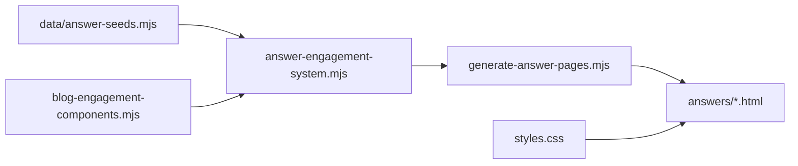

# Health Guide visual system — implementation report

**Phase:** 4 — Visual education system  
**Scope:** All 65 existing Health Guides (no new pages, no blogs)  
**Date:** 2026-06-04

---

## Goal

Create a **reusable** visual engagement layer so every Health Guide includes:

1. ≥1 visual element **above the fold** (after short answer)  
2. ≥1 **decision support** element (decision tree)  
3. ≥1 **evidence summary** card (snapshot before reference list)  
4. Mid-article **visual break** (myth, pearl, or takeaway on short pages)

---

## Architecture



| Layer | File | Role |
|-------|------|------|
| Primitives | `scripts/blog-engagement-components.mjs` | HTML builders (shared with cornerstone blogs) |
| Presets | `scripts/answer-engagement-system.mjs` | Topic/slug rules + Tier-1 overrides |
| Generator | `scripts/generate-answer-pages.mjs` | Injects blocks on every build |
| Styles | `styles.css` | `.blog-engage*` + answer-page table tweaks |
| Audit | `scripts/health-guide-visual-audit.mjs` | `HEALTH-GUIDE-VISUAL-AUDIT.md` |

**No per-page custom HTML** — rebuilding guides regenerates visuals.

---

## Component mapping

| Visual type | Class | Function | Typical use |
|-------------|-------|----------|-------------|
| Symptom flowchart | `blog-engage--flowchart` | `symptomFlowchart()` | ADHD, sleep, fatigue, hormone workups |
| Decision tree | `blog-engage--decision` | `decisionTree()` | **Required** on all guides |
| Comparison table | `blog-engage--comparison` | `comparisonTable()` | `*-vs-*`, SHBG, medication compares |
| Myth vs reality | `blog-engage--myth` | `mythVsReality()` | ADHD + metabolic myth-busting |
| Evidence snapshot | `blog-engage--evidence` | `evidenceSnapshot()` | **Required** — top 3 seed references |
| Clinical pearl | `blog-engage--pearl` | `clinicalPearl()` | Telehealth / general mid-break |
| Mini infographic | `blog-engage--infographic` | `miniInfographic()` | GLP-1, labs, quick reference |
| Key takeaway | `blog-engage--takeaway` | `keyTakeaway()` | Short paragraph-only guides |

**New in Phase 4:** `comparisonTable()` for Health Guides (tables were implicit in blogs only).

---

## Placement contract

| Slot | DOM position | Satisfies |
|------|--------------|-----------|
| **Above fold** | Immediately after `#short-answer` | Visual engagement before long prose |
| **Mid break** | After section index 1 (or 0 if single section) | Wall-of-text relief |
| **Decision support** | After all `answer-section` blocks | Action-oriented care path |
| **Evidence snapshot** | Inside `#evidence`, above `<ul class="answer-evidence-list">` | Scannable evidence before citations |
| **Takeaway (fallback)** | After paragraph-only body | Short guides without sections |

---

## Slug override tier (custom visuals)

These guides use tailored above-fold / mid content (not only topic defaults):

- `poor-sleep-feels-like-adhd`
- `brain-fog-after-eating`
- `why-normal-labs-dont-mean-healthy`
- `food-noise-returned-on-glp-1`
- `weight-gain-after-stopping-ozempic`
- `afternoon-energy-crash-after-lunch`
- `high-shbg-low-free-testosterone`
- `adderall-vs-vyvanse-adults`
- `tirzepatide-vs-semaglutide`

All other guides use **topic + slug-pattern** rules (`vs`, `how-long`, metabolic, hormone, default flowchart).

---

## Density & engagement analysis

See full per-guide tables in **`HEALTH-GUIDE-VISUAL-AUDIT.md`**.

| Bucket | Approx. count | Action |
|--------|-------------:|--------|
| **High density** (>900 words) | ~12 Tier-1 / long section guides | Mid myth/pearl + evidence card reduce skim fatigue |
| **Medium** (500–900) | ~35 | Standard 4-block layout |
| **Low** (<500) | 38 (Phase 5 expanded 20 priority guides to ≥500) | Standard 4-block layout + Phase 5 prose |

**Low engagement potential (content, not layout):** thin telehealth logistics pages (`fsa-hsa`, `what-included-199`) — visuals help scannability but conversion is inherently logistical.

**Pre-implementation gap:** 65/65 guides had **zero** `blog-engage` blocks in HTML (text-only). **Post-build (Phase 4):** all 65 guides have engagement blocks (0 with zero); typically ≥4 types (above, mid, decision, evidence).

**Phase 5 (thin expansion):** 20 priority guides expanded via `phase5-thin-expansions.mjs` — see `THIN-GUIDE-EXPANSION-REPORT.md`.

---

## Commands

```bash
cd apps/siya-health
npm run build                              # Regenerate all answer HTML with visuals
npm run health-guides:visual-audit         # HEALTH-GUIDE-VISUAL-AUDIT.md
npm run health-guides:thin-report          # THIN-GUIDE-EXPANSION-REPORT.md
npm run parity:cert                      # Production parity (post-deploy)
```

---

## QA checklist (post-build)

- [ ] Open `/answers/signs-of-adult-adhd` — flowchart after short answer, myth mid, decision tree, evidence card  
- [ ] Open `/answers/tirzepatide-vs-semaglutide` — comparison table above fold  
- [ ] Open `/answers/meet-and-greet-telehealth-expectations` — takeaway on short body  
- [ ] Mobile: comparison tables scroll horizontally  
- [ ] Single `aside.clinical-review` unchanged  

---

## Out of scope (per spec)

- New Health Guide URLs  
- New blog articles  
- Custom one-off HTML edits outside generator  

---

## Related documents

- **`HEALTH-GUIDE-VISUAL-AUDIT.md`** — per-guide visual type, placement, copy hook, density flags  
- **`PHASE-3-CONTENT-PRODUCTION-REPORT.md`** — Tier-1 content cluster  
- **`blog-engagement-components.mjs`** — cornerstone blog bundles (separate from answer presets)
