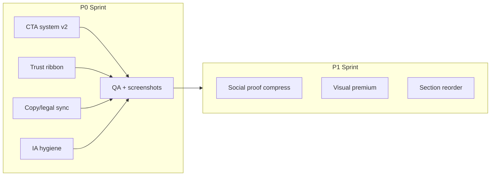

# Homepage Redesign Sprint — Consolidated Plan

**Status:** Planning only (no implementation)  
**Date:** 2026-06-06  
**Baseline:** Production homepage post CTA cleanup (`index.html` @ commit `2070f7e`)

---

## ⚠️ Transcript blocker

The **founder homepage walkthrough transcript** referenced in the request did **not** attach to this session (not in workspace, agent history, or Downloads).

**Action required:** Re-paste the transcript in chat or add `docs/HOMEPAGE-FOUNDER-WALKTHROUGH.md` so observations can be validated line-by-line.

Everything below is a **provisional sprint** synthesized from:

1. Live homepage audit (`index.html` + production)
2. Prior founder direction in project history ([HOMEPAGE-MESSAGING-REDESIGN.md](./HOMEPAGE-MESSAGING-REDESIGN.md), conversion notes, multi-service vs ADHD tension)
3. [UX-CTA-CLEANUP-REPORT.md](./UX-CTA-CLEANUP-REPORT.md) (recent ship)
4. [BRAND-PERCEPTION-AUDIT.md](../BRAND-PERCEPTION-AUDIT.md)

When the walkthrough transcript arrives, replace §2 observation IDs with verbatim quotes and re-rank §5–§7.

---

## 1. Extracted observations (provisional)

### CTA issues

| ID | Observation | Source |
|----|-------------|--------|
| CTA-01 | Nav still has **8 text links + 1 button** — high decision surface for a homepage | Live audit |
| CTA-02 | Hero has **3 actions** (Talk to a clinician, Find the Right Starting Point, See pricing) — tertiary pricing competes with symptom path | Live audit |
| CTA-03 | **Mobile sticky CTA** duplicates nav/hero booking — fourth booking touchpoint on scroll | Live audit |
| CTA-04 | Footer Services column still includes **Talk to a Clinician** (CarePatron) — redundant with nav/hero/final | Live audit |
| CTA-05 | Membership band: **two buttons** (pricing + Siya Circle) — newsletter competes with clinical conversion | Live audit |
| CTA-06 | Final CTA band is clean (2 buttons) but includes **orphan Siya Circle compliance line** with no Circle CTA | Live audit |
| CTA-07 | Symptom grid tile 1 still shows **"Free screening →"** on card — must stay `/adhd-screening`, not booking | Founder rule + live |
| CTA-08 | Testimonials use **text-link** booking (good); no button row after care team (good post-cleanup) | UX cleanup ship |
| CTA-09 | Historical founder feedback: nav should drop **Prescriptions / Labs** until ready | Prior founder MVP note |
| CTA-10 | Historical: paid ADHD traffic wants **screening or evaluation** visible without 5 competing booking labels | Prior conversion notes |
| CTA-11 | **Capitalization drift:** "Talk to a clinician" (hero) vs "Talk to a Clinician" (nav) — polish/trust signal | Live audit |

### Copy issues

| ID | Observation | Source |
|----|-------------|--------|
| COPY-01 | H1 **symptom-mirror** ("Something feels off…") aligns with symptom-first strategy — strong | Implemented spec |
| COPY-02 | Subhead is long (~2 lines mobile) — may truncate before trust bar on small viewports | Live audit |
| COPY-03 | Step 1 still says **"Meet & Greet"** — brand moving to "Talk to a Clinician" / physician-led | Live audit |
| COPY-04 | **"5,000+ in medical weight loss"** remains with `TODO:VERIFY-SOURCE` in HTML — marketing risk | Live audit |
| COPY-05 | Founder story is **single-founder** (Dr. Sneh); older brand spec envisioned **both founders** | Spec vs live |
| COPY-06 | **"Verified Patient Experiences"** + HelloKlarity link — third-party review surface; strength depends on freshness | Live audit |
| COPY-07 | FAQ still says **"Meet and Greet"** in JSON-LD (`FAQPage` schema) while body copy updated | Live audit |
| COPY-08 | Weight-loss / GLP-1 pathway copy exists but **not visually prioritized** for future ad traffic | Prior founder note |
| COPY-09 | Entity split (**Siya Health Inc. vs Siya Healthcare, PLLC**) appears in FAQ state answer only — not hero/footer microcopy | Compliance pattern |
| COPY-10 | **"Primary care–led, not psychiatry"** — present in FAQ; could be earlier for positioning clarity | Brand audit |

### Visual issues

| ID | Observation | Source |
|----|-------------|--------|
| VIS-01 | **Hero background image** (`hero-telehealth-main.png`) — clinical/stock feel; spec asked for calmer patient-at-laptop aesthetic | Messaging spec |
| VIS-02 | **Symptom chips** in hero are `aria-hidden` — decorative only; tiles below do real work | Live audit |
| VIS-03 | **6 testimonial cards** — dense grid; brand audit flagged duplicate/heavy social proof | Brand audit |
| VIS-04 | **Transparent header over hero** — premium when scrolled; contrast/readability on load needs mobile check | Visual audits |
| VIS-05 | **Diagram** (symptom loop SVG) in "Why patients come" — good premium signal; ensure mobile scale | Implemented |
| VIS-06 | **Typography** Poppins/Inter sitewide on homepage — consistent post Merriweather cleanup on other pages | Design system |
| VIS-07 | Pathway cards use emoji icons (🧠 ⚖️) — friendly but less "premium physician" than line icons | Live audit |
| VIS-08 | Founder photo block exists — good; crop/aspect and mobile stack order need screenshot QA | Live audit |

### Trust issues

| ID | Observation | Source |
|----|-------------|--------|
| TRUST-01 | Hero trust bar: **4 text pills** — no LegitScript/Creyos logos (those are footer-only) | Live vs prior spec |
| TRUST-02 | **LegitScript seal** in footer — good; not repeated above fold where DTC competitors show certification | Prior conversion spec |
| TRUST-03 | **"Board-certified clinicians"** — qualitative; no named credential density above fold | Live audit |
| TRUST-04 | **"1,000+ adults evaluated"** was recommended over unverified **10k** — verify `trust-metrics.js` doesn't inject stale counts | Messaging spec |
| TRUST-05 | Testimonials tagged **"Verified Patient"** without star rating aggregate on homepage | Live audit |
| TRUST-06 | **Provider cards** show names only + profile links (post cleanup) — trust through credentials, not booking spam | UX cleanup |
| TRUST-07 | Pending review badges **removed from homepage**; guides still use Clinician-informed elsewhere | UX cleanup |

### Provider presentation issues

| ID | Observation | Source |
|----|-------------|--------|
| PROV-01 | Care team section shows **7 clinicians** with photos + "View profile" — aligned with physician-led model | Live audit |
| PROV-02 | **No per-card booking** on homepage (fixed) — reduces "marketplace" feel | UX cleanup |
| PROV-03 | Taglines mix **service + state** well; OH on Derek may confuse "where we serve" vs license display | Live audit |
| PROV-04 | Founder section links to **Dr. Sneh profile only** — other founders/clinical leadership absent | Live audit |
| PROV-05 | Historical: homepage provider section was **too heavy** for top-of-funnel — now lighter but still 7 cards | Prior founder note |

### Legal / compliance presentation issues

| ID | Observation | Source |
|----|-------------|--------|
| LEGAL-01 | **Screening is not diagnosis** — present in symptoms transition + FAQ — good | Live audit |
| LEGAL-02 | **Medication not guaranteed** + controlled substance initial visit — FAQ + flow note — good | Live audit |
| LEGAL-03 | **5,000+ patients** unverified — compliance/marketing exposure if left live | Live audit |
| LEGAL-04 | **Siya Circle** compliance note in final CTA without adjacent product CTA — confusing; may imply newsletter is medical | Live audit |
| LEGAL-05 | Footer emergency line present; **canonical entity statement** (Inc. admin / PLLC clinical) not on homepage body | Site standards |
| LEGAL-06 | Booking goes **direct to CarePatron**; `/intake` legal gate bypassed on primary CTAs — intentional but document in sprint | CarePatron migration |
| LEGAL-07 | Schema `FAQPage` may still contain **stale Meet & Greet** wording — SEO/trust consistency | Live audit |

### Homepage architecture issues

| ID | Observation | Source |
|----|-------------|--------|
| ARCH-01 | **10 sections** before footer — long scroll; no sticky section nav or progress | Live audit |
| ARCH-02 | Section order matches symptom-first wireframe: Hero → Symptoms → Why → How → Pathways → Team → Reviews → Membership → Founder → FAQ → Final | Messaging spec |
| ARCH-03 | **No dedicated "Our Services" grid** — replaced by pathways (good) | Implemented |
| ARCH-04 | **Membership + Siya Circle** mid-page may interrupt trust momentum before founder story | Live audit |
| ARCH-05 | **FAQ at bottom** — good for SEO; consider 3–4 top questions elevated for ADHD paid landing | Conversion history |
| ARCH-06 | **Footer still lists Labs / Prescriptions** while nav omits — IA inconsistency | Live audit |
| ARCH-07 | Tension: **multi-service homepage** vs **90% ADHD paid traffic** — pathways handle this; hero is intentionally broad | Founder strategy arc |
| ARCH-08 | **Health Guides + Blog** in nav — education-heavy nav for conversion-first homepage | Live audit |

---

## 2. Grouped observation counts

| Category | Count |
|----------|------:|
| CTA issues | 11 |
| Copy issues | 10 |
| Visual issues | 8 |
| Trust issues | 7 |
| Provider presentation | 5 |
| Legal/compliance | 7 |
| Homepage architecture | 8 |
| **Total** | **56** |

---

## 3. Recurring themes

1. **One clear primary action** — Founder and recent UX work agree: fewer booking labels, one physician-led path, screening separate from booking.
2. **Physician-led, not marketplace** — Profile links over per-provider booking; clinical copy over sales CTAs.
3. **Symptom-first, service-second** — Homepage architecture is largely right; polish is about weight, order, and trust density.
4. **Trust above the fold** — Certifications, verified counts, and entity clarity should appear earlier, not only in footer.
5. **IA consistency** — Nav, footer, and schema still drift (Prescriptions/Labs, Meet & Greet vs Talk to a Clinician).
6. **Verified claims only** — 5,000+, patient counts, and review stats need source discipline.
7. **ADHD acquisition vs multi-service brand** — Resolved structurally via pathways; hero stays broad by design.
8. **Premium visual system** — Emoji pathway icons, hero stock art, and testimonial density work against "Circle Medical / One Medical" tier.

---

## 4. Ranked changes (conversion × trust × effort)

Scoring: **Conversion** and **Trust** = H/M/L impact · **Effort** = S/M/L (S ≈ <½ day, M ≈ 1–2 days, L ≈ 3+ days)

| Rank | ID | Change (coordinated) | Conv | Trust | Effort |
|------|-----|----------------------|------|-------|--------|
| 1 | Sprint-A | **Homepage CTA system v2:** 1 primary + 1 secondary sitewide on homepage; remove footer booking link; hide or contextualize mobile sticky; demote Siya Circle to text link in membership | H | M | S |
| 2 | Sprint-B | **Trust ribbon upgrade:** Add LegitScript + HIPAA (+ optional Creyos) to hero trust bar; remove unverified metrics; align `trust-metrics.js` | H | H | S |
| 3 | LEGAL-03/04 | **Claims hardening:** Remove or source-verify 5,000+; fix final CTA orphan Circle line | M | H | S |
| 4 | COPY-03/07 | **Language unify:** Meet & Greet → Talk to a Clinician / clinician conversation in How-it-works, FAQ, JSON-LD | M | M | S |
| 5 | ARCH-06/CTA-09 | **Footer/nav IA sync:** Drop or "coming soon" Labs/Prescriptions in footer; slim nav to 5–6 items | M | M | S |
| 6 | TRUST-05/VIS-03 | **Social proof compress:** 6 → 3 rotating testimonials + single HelloKlarity aggregate line | M | M | M |
| 7 | VIS-01/07 | **Premium visual pass:** Hero image swap; pathway emoji → icon set; mobile hero contrast QA | M | H | M |
| 8 | ARCH-04 | **Reorder membership block** below founder story (trust before monetization) | M | M | S |
| 9 | COPY-08 | **Weight-loss pathway elevation** — visual badge or second-row prominence for GLP-1 ad traffic | M | L | S |
| 10 | LEGAL-05 | **Entity microcopy** — one line under hero or in why-patients: Inc. admin / PLLC clinical | L | H | S |
| 11 | PROV-04/COPY-05 | **Founder story v2** — dual-founder or "clinical leadership" if accurate | L | M | M |
| 12 | ARCH-05 | **FAQ lift** — top 3 questions visible (medication, insurance, states) without accordion | M | M | M |
| 13 | LEGAL-06 | **Booking path policy** — document/direct: CarePatron vs `/intake` legal gate by CTA type | L | H | M |
| 14 | ARCH-01 | **Scroll length** — collapse "Why patients" + diagram into tighter band | L | M | M |

---

## 5. Priority tiers

### P0 — Must fix now (single coordinated sprint, ~1 week)

**Theme: "Trustworthy clarity — one door in"**

| Workstream | Includes | Obs IDs |
|------------|----------|---------|
| **WS1 — CTA consolidation** | Sprint-A: hero 2 CTAs max (drop tertiary pricing to text link); remove footer booking; mobile sticky only after scroll past hero OR remove; membership single primary button | CTA-01–08, 11 |
| **WS2 — Trust above fold** | Sprint-B: LegitScript/HIPAA in hero trust bar; audit `trust-metrics.js`; no unverified volume claims | TRUST-01–04, LEGAL-03 |
| **WS3 — Copy/legal sync** | Unify clinician language; fix FAQ JSON-LD; remove/fix 5,000+; entity one-liner; screening links audit on homepage | COPY-03, 04, 07, LEGAL-05, 07 |
| **WS4 — IA hygiene** | Footer/nav alignment (Labs/Prescriptions); capitalization consistency | ARCH-06, CTA-09, CTA-11 |

**P0 exit criteria**

- ≤3 branded buttons visible in first viewport (nav + hero)
- All screening CTAs → `/adhd-screening`
- All booking CTAs → CarePatron (documented)
- No unverified numeric claims live
- LegitScript visible above fold

### P1 — Next sprint (~2 weeks)

| Workstream | Includes | Obs IDs |
|------------|----------|---------|
| **WS5 — Social proof redesign** | 3 testimonials + aggregate rating; testimonial CTA remains text-only | VIS-03, TRUST-05 |
| **WS6 — Visual premium pass** | Hero art direction; pathway icons; transparent header mobile QA | VIS-01, 04, 07, 08 |
| **WS7 — Architecture tune** | Move membership below founder; weight-loss pathway emphasis; optional FAQ lift | ARCH-04, 05, COPY-08 |
| **WS8 — Founder block** | Expand leadership story if transcript confirms | PROV-04, COPY-05 |

### P2 — Future

| Item | Obs IDs |
|------|---------|
| Section-level sticky nav / progress indicator | ARCH-01 |
| Personalized hero variants for ADHD vs weight-loss ad landers (same URL, GTM) | ARCH-07 |
| Dual-founder photography system | COPY-05 |
| Intake legal gate on all booking entry points (product decision) | LEGAL-06 |
| A/B hero H1 variants (symptom vs physician-led) | COPY-01 |

---

## 6. Risk flags — founder requests to treat carefully

### Could reduce conversions

| Request pattern | Risk | Mitigation |
|-----------------|------|------------|
| Remove **all** booking CTAs except footer | Users who decide late lose obvious path | Keep **one** primary + **one** secondary max; text links elsewhere |
| Move **ADHD evaluation** to hero for paid traffic | Breaks multi-service homepage strategy | Use pathways + optional UTM hero variant, not permanent narrow hero |
| Add **Siya Circle** signup to hero/final band | Competes with clinical intent | Keep Circle in membership as text/secondary only |
| Cut **symptom grid** for shorter page | Loses self-segmentation for cold traffic | Compress copy, don't remove grid |
| Replace clinician CTA with **"Learn more" only** | Drops bottom-funnel intent | Physician-led CTA label tests OK; hiding booking is not |

### Compliance risk

| Request pattern | Risk | Mitigation |
|-----------------|------|------------|
| **Same-day stimulant** / guaranteed diagnosis copy | FDA/state telehealth advertising | Keep "when clinically appropriate"; no guarantees |
| **5,000+ / 10,000+ patients** without source | FTC/health marketing | Source or remove |
| **Neuro-spiritual / purpose** positioning (old spec) | Blurs medical vs wellness; psychiatry implication | Keep primary-care-led framing |
| **Skip legal intake** on all bookings | Terms/NPP acceptance gap | Policy: intake for first booking OR CarePatron embed terms |
| **Testimonials** with outcomes ("cured", "fixed ADHD") | HIPAA + substantiation | Keep "Verified Patient" + no outcome guarantees |

### SEO risk

| Request pattern | Risk | Mitigation |
|-----------------|------|------------|
| Shorten page drastically / remove FAQ | Loses FAQ rich results | Keep FAQ block; trim duplicate body copy instead |
| Change **H1/title** to ADHD-only for ads | Cannibalize multi-intent homepage | Use ad landing pages or meta experiments, not permanent narrow H1 |
| Remove **internal links** to guides/blog | Hub equity loss | Keep symptom tile links |
| Alter **JSON-LD** without matching visible FAQ | Rich result mismatch | Sync schema with visible copy in same sprint |

---

## 7. Coordinated sprint design (not 50 edits)

### Sprint name: **Homepage Trust & Clarity Sprint**

**Duration:** 5–7 working days  
**Owner:** Design + content + one eng  
**Files in scope:** `index.html`, `styles.css` (homepage section tokens only), `trust-metrics.js`, `scripts/site-chrome.mjs` (homepage-only injects if needed)

### Deliverables

| # | Deliverable |
|---|-------------|
| 1 | Updated `index.html` — single PR, not piecemeal |
| 2 | Before/after screenshot set (1440, 390) — hero, pathways, final CTA |
| 3 | CTA inventory table (≤3 above fold) |
| 4 | Claims audit sign-off (legal/compliance) |
| 5 | Updated FAQ JSON-LD matching visible copy |
| 6 | Post-deploy checklist on production URLs |

### Explicitly out of scope (this sprint)

- New pages or URL changes
- Service line additions
- Provider page generator changes
- Blog / Health Guide CTAs (handled sitewide separately)
- Full nav redesign across all templates (homepage + footer only unless chrome hook approved)

---

## 8. Next step when transcript arrives

1. Paste transcript into `docs/HOMEPAGE-FOUNDER-WALKTHROUGH.md`
2. Map each founder utterance → observation ID or new ID
3. Re-rank §4–§5 (founder vocal tone > provisional audit)
4. Add **verbatim quotes** to sprint tickets
5. Founder sign-off on P0 workstreams before implementation

---

## Appendix — Current homepage section map

| # | Section | Primary job |
|---|---------|-------------|
| 1 | Hero | Symptom recognition + dual CTA |
| 2 | Symptom grid | Self-segmentation |
| 3 | Why patients come | Emotional + clinical bridge |
| 4 | How it works | Process de-risking |
| 5 | Care pathways | Service routing |
| 6 | Care team | Physician credibility |
| 7 | Testimonials | Social proof |
| 8 | Membership / Circle | Monetization + education opt-in |
| 9 | Why Siya exists | Founder trust |
| 10 | FAQ | SEO + objection handling |
| 11 | Final CTA | Conversion close |

**Recent wins (do not regress):** Screening → `/adhd-screening`; provider cards without booking buttons; single final CTA pair; Clinician-informed badges off homepage.
