# Homepage Sprint Sequence — Dependency Map & Phased Rollout

**Status:** Strategy only — no implementation authorized  
**Date:** June 6, 2026  
**Parent doc:** [`HOMEPAGE-FOUNDER-AUDIT-SPRINT.md`](./HOMEPAGE-FOUNDER-AUDIT-SPRINT.md)  
**Goal:** Ship the smallest coherent bundles per sprint; measure after each; avoid 20 simultaneous homepage changes.

---

## Dependency Map (Visual)

```mermaid
flowchart TB
  subgraph sprintA ["Sprint A — Remove Friction"]
    P0_1[P0-1 Screening deep-link]
    P0_2[P0-2 Hero CTA]
    P0_3[P0-3 Final CTA]
    P1_10a[P1-10 GTM instrumentation]
  end

  subgraph sprintB ["Sprint B — Trust & Tone"]
    P0_4[P0-4 Trust compliance reshape]
    P0_6[P0-6 How care works]
    P0_5[P0-5 Siya Circle TM]
    P0_7[P0-7 Medical home copy]
    P1_2[P1-2 Provider humanization]
    P1_9[P1-9 Testimonial layout]
  end

  subgraph sprintC ["Sprint C — Depth & Navigation"]
    hubAudit[Hub link audit]
    P1_1[P1-1 Pathway links]
    P1_8[P1-8 Footer hubs]
    P1_4[P1-4 Membership rewrite]
    P1_3[P1-3 Founder layout]
    P1_11[P1-11 Symptom copy]
  end

  subgraph sprintD ["Sprint D+ — Future"]
    P1_5[P1-5 Step 4 ongoing]
    P1_6[P1-6 Trust photo]
    P1_7[P1-7 FAQ de-legaling]
    P1_10b[P1-10 Klarity decision]
    P2_1[P2-1 Physician video]
    P2_2[P2-2 Symptom router product]
    P2_3[P2-3 Provider card unification]
    P2_4[P2-4 ADHD de-emphasis]
    P2_5[P2-5 Sitewide compliance audit]
    P2_6[P2-6 On-site reviews]
    P2_7[P2-7 Photo library]
  end

  P0_1 --> P1_10a
  P0_2 --> P0_3
  P0_4 --> P1_7
  P0_4 --> P2_5
  P0_6 --> P1_5
  P1_2 --> P2_3
  P1_10a --> P1_10b
  P1_10b --> P2_6
  hubAudit --> P1_1
  hubAudit --> P1_8
  P1_1 --> P1_8
  P1_4 --> P1_5
  P1_6 --> P2_1
  P2_7 --> P1_6
  P2_2 -.->|re-enables| P0_2
```



**Legend:** Solid arrows = hard prerequisite. Dotted = future feature unlocks removed CTA.

---

## Item-by-Item Analysis

Effort scale: **XS** (&lt;2h) · **S** (2–4h) · **M** (4–8h / 1 day) · **L** (1–3 days) · **XL** (3+ days)  
Impact scale: **L** Low · **M** Medium · **H** High · **VH** Very High  
Rollback: **Low** = revert HTML/CSS/JS safely · **Med** = needs legal/content review · **High** = multi-template or data dependency

---

### P0 Items

| ID | Prerequisites | Conflicts | Bundle with | Effort | Conversion | Trust | Rollback |
|----|---------------|-----------|-------------|--------|------------|-------|----------|
| **P0-1** Screening deep-link | None; append `?start=asrs` to homepage screening links | **P2-2** (future router may replace param logic); shipping with **P0-4** confounds ASRS vs trust metrics | **P0-2, P0-3** (funnel friction trio) | **S** | **VH** | M | Low |
| **P0-2** Hero CTA simplify | Founder sign-off on single primary CTA | **P2-2** reintroduces secondary CTA later; with **P0-8** nav change confounds above-fold measurement | **P0-3** (same pattern top + bottom) | **XS** | **H** | M | Low |
| **P0-3** Final CTA band | **P0-2** (same decision) | Same as P0-2 | **P0-2** | **XS** | M | L | Low |
| **P0-4** Trust compliance reshape | Draft relocated disclosures; **legal review recommended** before ship | **P1-7** (FAQ de-legaling) — same theme, don't ship together; **P2-5** overlaps scope | **P0-6, P0-5, P0-7** (voice bundle) OR isolate alone for clean trust metric | **S** | M | **VH** | **Med** (compliance) |
| **P0-5** Remove Siya Circle™ | None | None | Any sprint as zero-cost tagalong | **XS** | L | L | Low |
| **P0-6** How care works rename | None | **P1-5** edits same section (ship P0-6 first, P1-5 later); **P2-4** further edits pathways/steps | **P0-7, P0-5** (copy voice) | **XS** | M | **H** | Low |
| **P0-7** Medical home copy | None | None | **P0-6** | **XS** | L | M | Low |
| **P0-8** Nav font bump | None | Confounds Sprint A hero/CTA experiment if shipped together | Ship **alone** or after Sprint A measurement window | **XS** | L | M | Low |

---

### P1 Items

| ID | Prerequisites | Conflicts | Bundle with | Effort | Conversion | Trust | Rollback |
|----|---------------|-----------|-------------|--------|------------|-------|----------|
| **P1-1** Pathway link consistency | **Hub audit** — which `/answers` topic anchors exist for fatigue, metabolic, men's health | **P1-8** duplicates link decisions — define hub list once; **P2-4** may reorder pathway emphasis | **P1-8** (navigation architecture) | **M** | M | M | Low |
| **P1-2** Provider humanization | None for CSS; copy warmth pairs with heading change | **P2-3** extends to generator data — don't block P1-2 on P2-3 | **P1-3, P1-9** (humanization band) | **M** | M | **VH** | Low |
| **P1-3** Founder layout rebalance | None | None | **P1-2** | **S** | L | **H** | Low |
| **P1-4** Membership rewrite | None | **P1-5** must align narrative with ops reality | **P1-5** (if ops confirms) | **S** | M | M | Low |
| **P1-5** Step 4 ongoing support | **Ops confirmation** that follow-up/membership is real; **P0-6** shipped first | Overpromising if membership ops immature | **P1-4** | **S** | M | M | Low |
| **P1-6** Trust section photo | **Photo asset** (existing or new); HIPAA/marketing approval if new | **P2-7** scales asset library | **P1-2, P1-3** | **M** | L | **H** | Low |
| **P1-7** FAQ de-legaling | **Legal review**; **P0-4** establishes compliance placement pattern first | Shipping with **P0-4** = unmeasurable trust delta | **P2-5** (sitewide) | **M** | L | **H** | **Med** |
| **P1-8** Footer hub architecture | **Curated link list** (5–7 per column); guardrail: existing URLs only | **P1-1** — coordinate hub URLs; stuffing links hurts SEO | **P1-1** after shared hub audit | **M** | M | M | Low |
| **P1-9** Testimonial layout | None | None | **P1-2** band | **XS** | L | M | Low |
| **P1-10** Klarity analytics | GTM events on `reviews-link` + booking | **P2-6** decision blocked until 30-day read | **Sprint A: instrument only**; decision in Sprint D+ | **XS** / none | — | — | Low |
| **P1-11** Symptom copy polish | None | Minor copy churn if measured with **P0-6** in same sprint | **P1-3** or defer to Sprint C tail | **XS** | L | M | Low |

---

### P2 Items

| ID | Prerequisites | Conflicts | Bundle with | Effort | Conversion | Trust | Rollback |
|----|---------------|-----------|-------------|--------|------------|-------|----------|
| **P2-1** Physician video | Script, legal, production, hosting | **P1-6** photo may be sufficient short-term | **P2-7** assets | **XL** | M | **VH** | Med |
| **P2-2** Symptom router product | Product spec, eng, compliance (not diagnosis) | Re-enables "Find Starting Point" — conflicts with **P0-2** intent until ready | Standalone product sprint | **XL** | **VH** | H | High |
| **P2-3** Provider card unification | Provider data in generator | **P1-2** should ship first (visual); P2-3 adds content layer | **P1-2** | **M** | L | M | Low |
| **P2-4** ADHD de-emphasis | Sprint B/C positioning stable | **P0-1** / ADHD funnel — don't reduce ADHD pathway visibility | **P0-6, P0-7** | **S** | M* | H | Low |
| **P2-5** Sitewide compliance audit | **P0-4** + **P1-7** learnings | Large blast radius — don't combine with conversion experiments | **P1-7** | **XL** | L | **H** | **High** |
| **P2-6** On-site reviews | **P1-10** data; legal testimonial rules | Removes Klarity — may drop social proof short-term | After Klarity decision | **L** | M | H | Med |
| **P2-7** Photo library | Shoot budget, HIPAA review | Feeds **P1-6**, **P2-1** | Asset sprint | **XL** | L | H | Low |

\*P2-4 conversion impact is **mixed** — may slightly reduce ADHD CTR while improving broader audience trust.

---

## Conflict Matrix (Quick Reference)

| Item A | Item B | Conflict type | Resolution |
|--------|--------|---------------|------------|
| P0-1 | P0-4 | Measurement | Separate sprints — A vs B |
| P0-2 | P0-8 | Measurement | P0-8 after A window |
| P0-4 | P1-7 | Scope + measurement | P0-4 in B; P1-7 in D+ |
| P0-6 | P1-5 | Same DOM section | P0-6 first; P1-5 later |
| P1-1 | P1-8 | Duplicate link IA work | Single hub audit → both |
| P1-4 | P1-5 | Narrative consistency | Ship together or P1-4 alone |
| P1-10 | P2-6 | Decision gate | 30 days data before P2-6 |
| P0-2 | P2-2 | Product | P2-2 unlocks secondary CTA intentionally |
| P1-2 | P2-3 | Sequencing | Visual first, data second |

---

## Recommended Bundles (Logical Groups)

| Bundle name | Items | Theme | Why together |
|-------------|-------|-------|--------------|
| **Friction removal** | P0-1, P0-2, P0-3 | Conversion | Same user journey — intent → action |
| **Voice & framing** | P0-5, P0-6, P0-7 | Trust/tone | All XS copy; one deploy |
| **Trust compliance** | P0-4 | Trust | Isolate for legal + metric clarity |
| **Human faces** | P1-2, P1-3, P1-9 | Trust | One visual pass on people sections |
| **Hub architecture** | Hub audit → P1-1, P1-8 | SEO + UX | One link inventory |
| **Retention story** | P1-4, P1-5 | Conversion | Membership narrative + care steps |
| **Instrumentation** | P1-10 (phase 1) | Decision | Zero UX risk; start Day 1 |
| **Compliance scale** | P1-7, P2-5 | Risk mgmt | After homepage pattern proven |
| **Human media** | P1-6, P2-1, P2-7 | Trust | Asset-dependent |

---

## Sprint A — Remove Friction

**Theme:** Honor user intent; one clear action; fix the highest-leak funnel step.  
**Duration:** 3–5 dev days + **14-day measurement window** before Sprint B.  
**Total effort:** **~4–6 hours** dev (+ GTM setup ~1h)

### Included

| ID | Item | Effort | Conversion | Trust |
|----|------|--------|------------|-------|
| P0-1 | ADHD screening deep-link (`?start=asrs`) | S | VH | M |
| P0-2 | Hero: remove "Find the Right Starting Point" | XS | H | M |
| P0-3 | Final CTA: single button | XS | M | L |
| P1-10 | **Instrument only** — Klarity + screening + hero CTA events | XS | — | — |

### Excluded (and why)

| Item | Why wait |
|------|----------|
| P0-4 | Trust copy confounds conversion metrics |
| P0-6–P0-8 | Tone/nav changes muddle above-fold experiment |
| P1-2+ | Trust work belongs in Sprint B |

### Expected impact

| Metric | Expected delta (14–30d) | Confidence |
|--------|-------------------------|------------|
| ASRS start rate (from screening CTAs) | +15–25% | High |
| Hero primary CTA CTR | +8–15% | Medium |
| CarePatron bookings (homepage-attributed) | +5–10% | Medium |
| Bounce rate | −3–7% | Medium |
| Trust perception | +5% (secondary — less funnel feel) | Low |

### Rollback risk: **Low**

Revert: remove query param from links; restore hero/final secondary buttons. No legal exposure. Screening chooser still works for organic traffic.

### Measurement checklist (end of Sprint A)

- [ ] GTM: `screening-cta-click` → `asrs-step-0-view` funnel
- [ ] GTM: `hero-cta-primary` click rate vs baseline
- [ ] GTM: CarePatron outbound from homepage
- [ ] Compare 14d pre/post; minimum n=500 homepage sessions for directional read

---

## Sprint B — Trust & Physician-Led Tone

**Theme:** Care first, regulated second; faces over diagrams; plain clinical language.  
**Prerequisite:** Sprint A measurement complete (or at least 7d stable baseline).  
**Duration:** 5–8 dev days + **14-day measurement window**.  
**Total effort:** **~1.5–2 days**

### Included

| ID | Item | Effort | Conversion | Trust |
|----|------|--------|------------|-------|
| P0-4 | Trust section compliance reshape | S | M | VH |
| P0-6 | "How care works" + de-ADHD step 1 | XS | M | H |
| P0-5 | Siya Circle™ removal | XS | L | L |
| P0-7 | "Medical home" → clearer telehealth title | XS | L | M |
| P1-2 | Provider photos 128–160px, card affordance, warmer H2 | M | M | VH |
| P1-9 | Testimonial subhead alignment | XS | L | M |

### Optional add (if capacity)

| ID | Condition |
|----|-----------|
| P0-8 | Nav font — only if Sprint A metrics are stable; otherwise Sprint C |

### Excluded

| Item | Why wait |
|------|----------|
| P1-7 | FAQ scope too broad; legal review — Sprint D+ |
| P1-1, P1-8 | Navigation architecture — Sprint C |
| P1-6 | Needs photo asset — Sprint C or D+ |

### Expected impact

| Metric | Expected delta | Confidence |
|--------|----------------|------------|
| Homepage bounce rate | −5–10% (cumulative) | Medium |
| Provider profile clicks from homepage | +15–25% | High |
| Scroll depth to care team | +10% | Medium |
| Booking conversion (profile → book) | +3–7% | Medium |
| Qualitative trust (session recordings) | Improved "physician-led" read | Medium |

### Rollback risk: **Medium**

**P0-4** requires legal comfort — keep pre-change copy in git; compliance aside must remain visible pre-booking on rollback. Visual/CSS changes (P1-2) rollback cleanly.

### Measurement checklist

- [ ] Profile click rate from `#care-team`
- [ ] Heatmap: trust section engagement time
- [ ] Booking rate — ensure no drop after disclosure relocation
- [ ] Legal spot-check: state eligibility + screening disclaimer still visible pre-CTA

---

## Sprint C — Navigation Depth & Retention Narrative

**Theme:** Help self-serve researchers; consistent hubs; mid-funnel relationship story.  
**Prerequisite:** Hub link audit complete; Sprint B trust metrics stable.  
**Duration:** 8–12 dev days + **21-day measurement window**.  
**Total effort:** **~2–3 days**

### Included

| ID | Item | Effort | Conversion | Trust |
|----|------|--------|------------|-------|
| — | **Hub link audit** (fatigue, metabolic, men's health, ADHD) | S | — | — |
| P1-1 | Pathway → service + guide hub | M | M | M |
| P1-8 | Footer hub columns (curated, 5–7 links each) | M | M | M |
| P1-4 | Membership band rewrite (continuity, education) | S | M | M |
| P1-3 | Founder image column rebalance | S | L | H |
| P1-11 | Symptom section copy polish | XS | L | M |

### Conditional (same sprint if ready)

| ID | Condition |
|----|-----------|
| P1-5 | Ops confirms ongoing follow-up / membership delivery |
| P1-6 | Trust photo asset approved |
| P0-8 | Deferred from A/B if not yet shipped |

### Excluded → Sprint D+

| Items |
|-------|
| P1-7, P2-1, P2-2, P2-5, P2-6 (await P1-10 data), P2-3, P2-4, P2-7 |

### Expected impact

| Metric | Expected delta | Confidence |
|--------|----------------|------------|
| Internal link CTR (pathway + footer) | +20–30% | Medium |
| `/answers` pages/session from homepage | +10–15% | Medium |
| `/membership-pricing` visits from homepage | +5–10% | Low–Medium |
| SEO: crawl depth to guides (30–60d) | Incremental | Low |
| Long-term booking (assisted conversion) | +3–5% | Low |

### Rollback risk: **Low**

Link and copy changes revert cleanly. Footer expansion is additive — rollback to prior footer without SEO penalty.

### Measurement checklist

- [ ] Pathway secondary link clicks by card
- [ ] Footer link clicks (new columns)
- [ ] Membership page entry rate
- [ ] Organic landing on guide hubs (GSC, 30d lag)

---

## Sprint D+ Backlog (Post C — Not in initial 3 sprints)

| Priority | Items | Trigger |
|----------|-------|---------|
| 1 | **P1-10 decision** → keep/remove Klarity | 30d data from Sprint A |
| 2 | **P1-7** FAQ de-legaling | Sprint B trust compliance validated |
| 3 | **P2-6** On-site reviews | Klarity hurts conversion in data |
| 4 | **P2-3** Provider card content unification | After P1-2 visual win |
| 5 | **P2-4** ADHD de-emphasis pass | If brand still reads ADHD-first in user tests |
| 6 | **P2-1** Physician video | Asset/production budget approved |
| 7 | **P2-5** Sitewide compliance audit | Before next major marketing push |
| 8 | **P2-2** Symptom router product | Product roadmap slot |
| 9 | **P2-7** Photography library | Brand/marketing initiative |

---

## Master Sequence Summary

```
Week 0     │ Sprint A ship (P0-1, P0-2, P0-3, P1-10 instrument)
Week 0–2   │ Measure A (14d minimum)
Week 2–3   │ Sprint B ship (P0-4, P0-5, P0-6, P0-7, P1-2, P1-9)
Week 3–5   │ Measure B (14d)
Week 4     │ Hub audit (parallel, content/SEO)
Week 5–6   │ Sprint C ship (P1-1, P1-8, P1-4, P1-3, P1-11 + conditional)
Week 6–9   │ Measure C (21d — SEO slower)
Week 9+    │ Sprint D+ per triggers
```

| Sprint | Items count | Dev effort | Conversion impact | Trust impact | Rollback risk |
|--------|-------------|------------|-------------------|--------------|---------------|
| **A** | 4 (3 UX + 1 analytics) | **~6h** | **VH** | M | Low |
| **B** | 6 | **~12–16h** | M | **VH** | Med |
| **C** | 6–8 | **~16–24h** | M | H | Low |
| **D+** | 9 P2 + P1-7 | Weeks–months | M–H | H–VH | Med–High |

---

## What NOT to Ship Together

1. **P0-1 + P0-4** — can't attribute ASRS lift vs trust copy lift  
2. **P0-4 + P1-7** — doubles compliance scope; one legal review cycle  
3. **P1-1 + P1-8 without hub audit** — duplicate work, inconsistent URLs  
4. **P1-4 + P2-2** — don't promise ecosystem before router exists  
5. **P2-6 + P1-10** — decide on data first  
6. **Any sprint + P2-5** — sitewide blast radius kills measurement  

---

## Rollback Playbook (Per Sprint)

| Sprint | Rollback trigger | Action | Risk |
|--------|------------------|--------|------|
| A | ASRS completions drop | Restore chooser as default; keep deep-link as optional | Low |
| A | Hero CTR drops >15% | Restore secondary anchor CTA to symptom grid | Low |
| B | Booking rate drops post-disclosure move | Restore inline MSO/disclaimer in trust block | Med — legal |
| B | Provider layout breaks mobile | Revert avatar CSS | Low |
| C | Footer link clutter hurts engagement | Remove new columns; keep pathway fixes | Low |

---

## Document History

| Version | Notes |
|---------|-------|
| v1.0 | Dependency map + Sprint A/B/C sequence from founder audit backlog |
