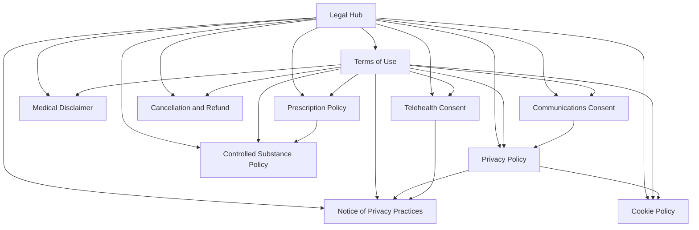

# Legal Architecture Audit & Implementation Plan

**Practice:** Siya Health  
**Source of truth:** `docs/TERMS-OF-USE-GAP-AUDIT.md`, `docs/LEGAL-COMPLIANCE-GAP-ANALYSIS.md`  
**Counsel drafts on file (partial, not live):** `docs/legal-drafts/WEBSITE-TERMS-OF-USE-LAWYER-DRAFT.md`, `WEBSITE-PRIVACY-POLICY-LAWYER-DRAFT.md`, `WEBSITE-NOTICE-OF-PRIVACY-PRACTICES-LAWYER-DRAFT.md`  
**Plan date:** 2026-06-02  
**Document type:** Strategic implementation blueprint — **no legal language, no production deploy**

---

## 1. Executive summary

Siya Health’s legal posture is **not production-ready**. Two live URLs (`/terms`, `/privacy-policy`) contain marketing-page shells with ~36 and ~30 words of enforceable text respectively. HIPAA NPP, telehealth consent, cookie policy, and prescribing governance are absent. Eighteen marketing pages mislabel `/privacy-policy` as “Notice of Privacy Practices.”

**Organizational service footprint (authoritative):** California, Texas, Florida, Pennsylvania only.  
**Provider licensure footprint:** Separate data layer — must not expand or contract organizational availability.  
**Clinical positioning (authoritative):** Primary care–led adult ADHD evaluation and treatment; Internal Medicine; Family Medicine; Obesity Medicine; ADHD-CCSP–trained clinicians. **Not** a psychiatry or psychology practice.

**Deploy gate:** Legal/compliance sign-off requires completion of all items marked **Required before production deploy** below, plus removal of false NPP links and unsubstantiated marketing claims identified in source audits.

---

## 2. Operational and clinical constraints (governance rules)

These rules govern all document drafting, cross-links, and marketing copy — independent of individual provider license tables.

| Rule | Implementation requirement |
|------|---------------------------|
| **Organizational service states** | Legal documents may state telehealth availability only in **CA, TX, FL, PA**. Use `LICENSED_STATES` from `data/site-standards.mjs` as the single source. |
| **Provider licensure ≠ org footprint** | Provider profiles may list credentials and board links; they must **not** imply services are offered in states beyond the four above unless org footprint formally expands. |
| **ADHD positioning** | Policies describe **primary care–led** adult ADHD evaluation (DSM-informed clinical judgment, not self-diagnosis via screening alone). Explicitly **not** psychiatry/psychology practice positioning. |
| **Screening vs diagnosis** | ASRS and similar tools = screening only; full evaluation required for diagnosis/treatment decisions. |
| **Controlled substances** | Primary care clinicians may discuss stimulant therapy where clinically appropriate and lawful; policies must reflect **evaluation-before-prescribing**, not guaranteed Rx. |
| **Entity structure** | Counsel drafts name **Siya Health** (administrative) and **Siya Healthcare, PLLC** (clinical/PHI). Reconcile with footer “Siya Health Inc.” before publish. |
| **Lawyer drafts** | Partial counsel text exists; **do not treat as publishable** until complete, placeholder-free, and counsel-approved. |

---

## 3. Live legal/compliance inventory

### 3A. Standalone legal URLs (published)

| URL | File | Status | Policy words | Last updated | Audit completeness | Classification |
|-----|------|--------|-------------:|--------------|-------------------:|----------------|
| `/terms` | `terms.html` | **Live — fragment** | ~36 | Not stated | 12/100 | Replace before deploy |
| `/privacy-policy` | `privacy-policy.html` | **Live — fragment** | ~30 | Not stated | 15/100 | Replace before deploy |

**Live page defects (both):** Marketing hero, trust bar (volume/pricing/HIPAA claims), duplicate booking CTAs, GTM/GA/Ads without cookie governance, no effective date, no cross-document incorporation.

### 3B. Mislabeled or non-policy URLs referenced as legal

| URL | File | Actual content | Legal role | Issue |
|-----|------|----------------|------------|-------|
| `/prescriptions` | `prescriptions.html` | Marketing (“coming soon”) | **Not a policy** | Must not satisfy Prescription Policy requirement |
| `/privacy-policy` (as linked) | — | Website privacy fragment | **Misused as NPP** on 18 pages | False HIPAA reference |

**Pages falsely linking NPP → `/privacy-policy`:** `index.html`, `about.html`, `adhd-care.html`, `telehealth.html`, `weight-loss-metabolic-health.html`, `membership-pricing.html`, and 12 ADHD landing variants (per `TERMS-OF-USE-GAP-AUDIT.md`).

### 3C. Embedded / partial compliance (not standalone documents)

| Artifact | Coverage | Locations | Classification |
|----------|----------|-----------|----------------|
| `blog-disclaimer` / educational-only | **127 pages** | `/blog/*`, `/answers/*` | Keep; supplement with Medical Disclaimer page |
| Footer `footer-notice` (911) | **158 pages** | Sitewide footer | Partial emergency disclaimer — not a policy |
| LegitScript seal | **24 pages** | Footer | Certification display; needs Advertising Compliance doc |
| Clinical review badge “Pending physician review” | **120 pages** | Content pages | Internal gate only; needs public Clinical Review Policy (30-day) |
| `blog-disclaimer` absent | **~32 pages** | Service, home, providers, membership | **Deploy blocker** for conversion-page disclaimer strip |

### 3D. Internal governance (not public legal pages)

| Artifact | Path | Public? |
|----------|------|---------|
| Content review registry | `data/content-review-registry.mjs` | No |
| Publishing minimums | `docs/PROVIDER-PUBLISHING-MINIMUMS.md` | No |
| Legal link mapping (bug) | `data/site-standards.mjs` → `noticeOfPrivacy: '/privacy-policy'` | Code — fix before deploy |
| Lawyer draft captures | `docs/legal-drafts/*.md` | No — counsel work in progress |

### 3E. Third-party systems requiring policy disclosure (operational)

| System | ID / domain | Disclosure needed in |
|--------|-------------|----------------------|
| Google Tag Manager | `GTM-PLBD4TTQ` | Privacy Policy, Cookie Policy |
| Google Analytics | `G-9WTQWHCTFT` | Privacy Policy, Cookie Policy |
| Google Ads | `AW-17553537456` | Privacy Policy, Cookie Policy, Advertising Compliance |
| GHL booking / intake | `link.yourmarketingai.com` | Privacy Policy, Terms, Telehealth Consent, Communications Consent |
| LeadConnector chat | `widgets.leadconnectorhq.com` | Privacy Policy, Terms |
| LegitScript | Footer verification link | Advertising Compliance |
| Creyos (optional testing) | Footer logo | Terms, Privacy, Telehealth Consent |
| HelloKlarity (external reviews) | Linked from membership | Terms, Advertising Compliance |

---

## 4. Missing legal/compliance documents inventory

### 4A. Required program documents (user-specified architecture)

| # | Document | Target URL | Exists? | Priority tier |
|---|----------|------------|---------|---------------|
| 1 | Terms of Use | `/legal/terms-of-use` | Partial live + partial counsel draft | **Deploy** |
| 2 | Privacy Policy | `/legal/privacy-policy` | Partial live + partial counsel draft | **Deploy** |
| 3 | Notice of Privacy Practices | `/legal/notice-of-privacy-practices` | Partial counsel draft only | **Deploy** |
| 4 | Telehealth Consent | `/legal/telehealth-consent` | **Missing** | **Deploy** |
| 5 | Medical Disclaimer | `/legal/medical-disclaimer` | Embedded only | **Deploy** |
| 6 | Controlled Substance Policy | `/legal/controlled-substance-policy` | **Missing** | **Deploy** |
| 7 | Prescription Policy | `/legal/prescription-policy` | **Missing** | **30-day** |
| 8 | Cancellation & Refund Policy | `/legal/cancellation-refund-policy` | Marketing only | **30-day** |
| 9 | Communications Consent (SMS/Email) | `/legal/communications-consent` | **Missing** | **30-day** |
| 10 | Cookie Policy | `/legal/cookie-policy` | **Missing** | **Deploy** |
| 11 | Legal Hub | `/legal` | **Missing** | **Deploy** (index shell); expand at 30-day |

### 4B. Supplementary documents (from gap analysis — not in user’s 11, but architecturally related)

| Document | Target URL | Priority tier |
|----------|------------|---------------|
| Emergency Care Disclaimer (standalone) | `/legal/emergency-care` | **30-day** (footer partial exists) |
| Patient Relationship Disclaimer | `/legal/patient-relationship` | **30-day** |
| Advertising Compliance Policy | `/legal/advertising-compliance` | **30-day** |
| Clinical Review Policy (public) | `/legal/clinical-review` | **30-day** |
| Editorial Standards (public) | `/legal/editorial-standards` | **Nice to have** |
| Accessibility Statement | `/legal/accessibility` | **Nice to have** |
| Medical Compliance in Marketing SOP v1.0 (internal) | `docs/MEDICAL-COMPLIANCE-IN-MARKETING-SOP-v1.0.md` | **30-day** (repo governance) |

---

## 5. Priority classification summary

### Required before production deploy

| Item | Rationale (from source audits) |
|------|-------------------------------|
| Notice of Privacy Practices | HIPAA covered entity; PHI collected at intake; false NPP links today |
| Privacy Policy (replacement) | False “no PHI” statement; tracking/subprocessors undisclosed |
| Terms of Use (replacement) | ~36 words; no telehealth, entity, arbitration, or incorporation |
| Telehealth Consent | State board + multi-state telehealth; Ryan Haight alignment |
| Medical Disclaimer (standalone + service-page strip) | 32 conversion pages lack disclaimer |
| Controlled Substance Policy | 77 pages reference stimulants; ADHD medication marketed |
| Cookie Policy + consent mechanism | GTM/GA/Ads on 159 pages |
| Legal Hub (minimum viable index) | Discoverability; fix false NPP labeling |
| Code fix: `LEGAL_LINKS.noticeOfPrivacy` | Architecture bug |
| Remove false “NPP” links to `/privacy-policy` | 18 pages mislabeled |
| Remove unsubstantiated claims from legal templates | FTC / SOP (trust bars on terms/privacy) |
| Fix testimonial compliance or remove “Verified” | `/membership-pricing` FTC risk |

### Required within 30 days

| Item | Rationale |
|------|-----------|
| Prescription Policy | GLP-1, compounded, TRT, tele-Rx; FDA/DEA/state boards |
| Cancellation & Refund Policy | “Cancel Anytime,” “$199” marketing without binding terms |
| Communications Consent | GHL SMS/email automation; TCPA/CAN-SPAM |
| Emergency Care Disclaimer (expanded 911/988) | Primary/urgent + ADHD positioning |
| Patient Relationship Disclaimer | Website use ≠ physician–patient relationship |
| Advertising Compliance Policy | LegitScript, paid ads, testimonials, claim registry |
| Clinical Review Policy (public) | Explain “Pending physician review” badges |
| Marketing Claims Registry (`data/marketing-claims.mjs`) | Prevent recurrence of volume/rating claims |
| State addenda (CA, TX, FL, PA) within Terms/Telehealth/CS | Multi-state board alignment |
| Full Legal Hub (all document links) | After 30-day docs publish |
| 301 redirects `/terms`, `/privacy-policy` | SEO continuity |
| Intake clickwrap integration | Terms + NPP + Telehealth + Communications at booking |

### Nice to have

| Item | Rationale |
|------|-----------|
| Editorial Standards (public) | E-E-A-T; AI-assistance transparency |
| Accessibility Statement | ADA/WCAG |
| PDF exports (NPP, Telehealth Consent) | Offline intake ops |
| `generate-legal-pages.mjs` + CI link validator | Sustainable governance |
| Periodic legal audit script | Ongoing SOP enforcement |
| Women's health disclaimer module | When service page expands |

---

## 6. Recommended document architecture

### 6A. URL map

```
/legal                                    → Legal & Compliance Hub
/legal/terms-of-use                       → Terms of Use
/legal/privacy-policy                     → Website Privacy Policy (Personal Data)
/legal/notice-of-privacy-practices        → HIPAA NPP (PHI — Siya Healthcare, PLLC)
/legal/telehealth-consent                 → Telehealth Informed Consent
/legal/medical-disclaimer                 → Medical Disclaimer
/legal/controlled-substance-policy        → Controlled Substance Policy
/legal/prescription-policy                → Prescription Policy
/legal/cancellation-refund-policy         → Cancellation & Refund Policy
/legal/communications-consent             → SMS / Email Consent
/legal/cookie-policy                      → Cookie Policy

/legal/emergency-care                     → [30-day] Emergency Care Disclaimer
/legal/patient-relationship               → [30-day] Patient Relationship Disclaimer
/legal/advertising-compliance             → [30-day] Advertising Compliance
/legal/clinical-review                    → [30-day] Clinical Review Policy
/legal/editorial-standards                → [Nice to have]
/legal/accessibility                      → [Nice to have]
```

**Redirects:**

| Legacy | New |
|--------|-----|
| `/terms` | `/legal/terms-of-use` |
| `/privacy-policy` | `/legal/privacy-policy` |

**Marketing URLs unchanged:** `/prescriptions` links **to** `/legal/prescription-policy`.

### 6B. Data and build layer (implementation, not legal text)

```
data/
  legal-documents.mjs          # Registry: slug, title, version, effectiveDate, priority, regulatoryTags
  legal-document-versions/     # Counsel-approved source (git-tracked)
  marketing-claims.mjs         # [30-day] Substantiated marketing strings only

scripts/
  generate-legal-pages.mjs     # Neutral legal template (no marketing chrome)
  validate-legal-links.mjs     # CI: no 404 legal links; NPP ≠ privacy URL

data/site-standards.mjs
  LEGAL_LINKS                  # Single source for footer + cross-refs
  LICENSED_STATES              # Org footprint only (CA, TX, FL, PA)
```

### 6C. Cross-document dependency graph



### 6D. Sitewide injection matrix (post-publish)

| Component | Inject into | Links to |
|-----------|-------------|----------|
| `legalDisclaimerStrip` | Home, service pages, provider profiles | Medical Disclaimer, Emergency |
| `fairBalanceModule-adhd` | `/adhd-care`, ADHD landings | Medical Disclaimer, CS Policy, Telehealth Consent |
| `fairBalanceModule-metabolic` | `/weight-loss-metabolic-health` | Medical Disclaimer, Prescription Policy |
| `fairBalanceModule-mens` | `/mens-health-longevity` | Medical Disclaimer, Prescription Policy |
| `cookieConsentBanner` | All pages | Cookie Policy |
| `testimonialComplianceBlock` | `/membership-pricing` | Advertising Compliance |
| Unified footer Legal column | All pages via `site-chrome.mjs` | Legal Hub + tier-1 docs |

---

## 7. Per-document specification

*Sections listed are **required topics for counsel** — not drafted language.*

---

### 7.1 Terms of Use

| Field | Value |
|-------|-------|
| **URL** | `/legal/terms-of-use` |
| **Priority** | **Required before production deploy** |
| **Counsel status** | Partial draft in `legal-drafts/WEBSITE-TERMS-OF-USE-LAWYER-DRAFT.md` (through §4; §17 arbitration referenced but not received) |

**Purpose:** Master agreement governing website use, administrative services, and incorporation of all clinical and privacy policies; defines relationship between patient, Siya Health (admin), and Siya Healthcare, PLLC (clinical).

**Regulatory drivers:** State medical board advertising; FTC clear disclosure; platform liability; arbitration (if retained); multi-state telehealth; DEA/FDA prescribing boundaries by reference.

**Sections required:**

1. Parties, definitions, effective date, changes
2. Agreement / assent mechanism (browsewrap insufficient for clinical — reference intake clickwrap)
3. Privacy Policy incorporation
4. HIPAA NPP incorporation
5. Eligibility, capacity, age (reconcile counsel’s 13+ with adult service lines)
6. **Organizational service footprint: CA, TX, FL, PA only** — patient location attestation
7. **Not psychiatry/psychology** — primary care–led scope statement
8. Telehealth Consent incorporation
9. Medical Disclaimer incorporation
10. Controlled Substance Policy incorporation
11. Prescription Policy incorporation (by reference even if published Day 30)
12. Cancellation & Refund incorporation
13. Communications Consent incorporation
14. Cookie Policy incorporation
15. Emergency services exclusion (911; consider 988 cross-ref)
16. No physician–patient relationship until acceptance
17. Third-party services (GHL, analytics, chat, LegitScript, Creyos, review platforms)
18. Educational content / Health Guides — not medical advice
19. **ADHD addendum:** screening ≠ diagnosis; evaluation-before-treatment; primary care model
20. **Obesity medicine addendum:** no guaranteed weight loss; GLP-1 by reference to Prescription Policy
21. **Men’s health addendum:** testosterone evaluation framing; not lifestyle Rx marketing
22. **Primary care telehealth addendum:** scope limits; not emergency; not all conditions
23. Intellectual property, acceptable use, termination
24. Limitation of liability, warranty disclaimer, indemnification
25. Dispute resolution / arbitration (§17 per counsel draft)
26. Governing law, venue, severability, entire agreement
27. State addenda placeholders: CA, TX, FL, PA

**Related documents:** All tier-1 policies; Legal Hub; intake clickwrap config.

**Implementation notes:** Remove marketing hero/trust bar from template before publish. Standardize name to **Terms of Use** (resolve “Terms of Service” / “Terms & Conditions” drift).

---

### 7.2 Privacy Policy

| Field | Value |
|-------|-------|
| **URL** | `/legal/privacy-policy` |
| **Priority** | **Required before production deploy** |
| **Counsel status** | Partial draft in `legal-drafts/WEBSITE-PRIVACY-POLICY-LAWYER-DRAFT.md` |

**Purpose:** Govern collection, use, sharing, and retention of **Personal Data** (non-PHI) from website, analytics, marketing, and pre-clinical interactions.

**Regulatory drivers:** CCPA/CPRA; other state privacy laws (TX, FL, PA); FTC; CAN-SPAM (high-level, detail in Communications Consent); ePrivacy/cookie alignment.

**Sections required:**

1. Scope, effective date, changes, entity identification (Siya Health + Siya Healthcare, PLLC affiliate)
2. **PHI exclusion** — explicit pointer to NPP (counsel draft already frames this correctly)
3. Categories of Personal Data collected
4. Sources (direct, automatic, third parties)
5. Purposes of use
6. **Subprocessors table** (GTM, GA, Google Ads, GHL, LeadConnector)
7. Cookies and tracking — incorporate Cookie Policy by reference
8. Sharing / disclosure categories
9. Retention
10. Security measures (high-level)
11. Children under 13 (counsel draft present)
12. **Your State Privacy Rights** — CA, TX, FL, PA (+ others as counsel advises)
13. Marketing opt-out / Do Not Sell or Share
14. Contact / privacy requests
15. Relationship to Terms and NPP

**Related documents:** Cookie Policy, Communications Consent, NPP, Terms, Legal Hub.

---

### 7.3 Notice of Privacy Practices

| Field | Value |
|-------|-------|
| **URL** | `/legal/notice-of-privacy-practices` |
| **Priority** | **Required before production deploy** |
| **Counsel status** | Partial draft in `legal-drafts/WEBSITE-NOTICE-OF-PRIVACY-PRACTICES-LAWYER-DRAFT.md` (TPO started) |

**Purpose:** HIPAA-required notice for **Siya Healthcare, PLLC** covering PHI uses, disclosures, and patient rights.

**Regulatory drivers:** HIPAA Privacy Rule; HITECH; state health privacy (supplemental); OCR complaint process.

**Sections required:**

1. Header block (“THIS NOTICE DESCRIBES…”)
2. Covered entity identification
3. Effective date; change mechanism
4. Uses and disclosures — Treatment, Payment, Health Care Operations (complete TPO)
5. Other permitted/required uses and disclosures
6. Uses requiring authorization
7. Patient rights (access, amendment, accounting, restriction request, confidential communications, paper copy)
8. Breach notification (reference)
9. Business associates / subprocessors
10. Psychotherapy notes (if applicable — likely N/A given not psychology practice; counsel to confirm)
11. Marketing and sale of PHI prohibitions
12. Complaints — Practice contact + HHS OCR
13. Contact person / Privacy Officer
14. Acknowledgment of receipt process (ops artifact)

**Related documents:** Privacy Policy (non-PHI), Terms, Telehealth Consent, Legal Hub.

**Implementation notes:** **Must not** share URL with Privacy Policy. Fix `site-standards.mjs` and 18 mislinked pages on publish day.

---

### 7.4 Telehealth Consent

| Field | Value |
|-------|-------|
| **URL** | `/legal/telehealth-consent` |
| **Priority** | **Required before production deploy** |
| **Counsel status** | **Not started** (counsel) |

**Purpose:** Informed consent to receive care via telehealth modalities before clinical encounter; documents benefits, risks, limitations, and patient acknowledgments.

**Regulatory drivers:** State telehealth informed consent (CA, TX, FL, PA); Ryan Haight (modality for prescribing); medical board expectations.

**Sections required:**

1. Nature of telehealth relationship
2. **Organizational availability: CA, TX, FL, PA** — patient must be in licensed state
3. Modality (video, audio, async messaging if offered)
4. Technology requirements and failure fallback
5. Privacy and security of electronic communications (cross-ref NPP)
6. **Limitations of virtual exam** — when in-person required
7. **Emergency protocol** — not for emergencies; 911/988
8. Prescribing via telehealth (cross-ref CS and Prescription policies)
9. **ADHD-specific:** evaluation process; screening tools ≠ diagnosis
10. **Not psychiatry/psychology** — primary care–led care model
11. Recording policy
12. Consent to treat; withdrawal of consent
13. Patient signature / electronic assent fields (intake integration)
14. State-specific addenda: CA, TX, FL, PA

**Related documents:** NPP, Terms, Medical Disclaimer, Controlled Substance Policy, Prescription Policy, Emergency Care Disclaimer.

**Implementation notes:** Must be captured in GHL intake **before** first clinical visit — not page-only.

---

### 7.5 Medical Disclaimer

| Field | Value |
|-------|-------|
| **URL** | `/legal/medical-disclaimer` |
| **Priority** | **Required before production deploy** |
| **Counsel status** | **Not started** (embedded blog text exists as reference only) |

**Purpose:** Clarify website, Health Guides, and blog content is educational; not medical advice, diagnosis, or treatment; no doctor–patient relationship from browsing.

**Regulatory drivers:** FTC health claims; FDA unauthorized practice framing; state board advertising; inferred Marketing SOP.

**Sections required:**

1. General educational purpose
2. No doctor–patient relationship from site use alone
3. Not for emergencies
4. **Screening tools (ASRS) ≠ diagnosis**
5. Individual results vary; no outcome guarantees
6. **Primary care positioning** — not psychiatry/psychology emergency services
7. Clinician judgment required for treatment decisions
8. Third-party content and links
9. Physician review status of content (cross-ref Clinical Review Policy at 30-day)
10. When to seek in-person care

**Related documents:** Terms, Telehealth Consent, Editorial Standards, Clinical Review Policy, Legal Hub.

**Implementation notes:** Deploy `legalDisclaimerStrip` on ~32 conversion pages identified in gap analysis.

---

### 7.6 Controlled Substance Policy

| Field | Value |
|-------|-------|
| **URL** | `/legal/controlled-substance-policy` |
| **Priority** | **Required before production deploy** |
| **Counsel status** | **Not started** |

**Purpose:** Practice standards for Schedule II–IV prescribing via telehealth, especially ADHD stimulants; DEA and state compliance framework.

**Regulatory drivers:** DEA; Ryan Haight Act; state PDMP rules (CA, TX, FL, PA); medical board prescribing advertising.

**Sections required:**

1. Scope — **primary care–led ADHD treatment**, obesity/other CS as applicable
2. Evaluation-before-prescribing requirement
3. **No guarantee of stimulant prescription**
4. Teleprescribing eligibility and limitations
5. Ryan Haight / federal telemedicine prescribing rules
6. PDMP query and monitoring obligations
7. Refill intervals, early refill, lost medication
8. Diversion, misuse, urine drug screen policy (if used)
9. Identity verification
10. Referral/out when CS inappropriate (comorbidity, substance use disorder)
11. **Not a psychiatry practice** — scope of primary care CS management
12. State addenda: CA, TX, FL, PA
13. Patient responsibilities

**Related documents:** Terms, Telehealth Consent, Prescription Policy, Medical Disclaimer, NPP.

**Implementation notes:** Mandatory link from `/adhd-care` and stimulant-related content clusters (77 pages per scan).

---

### 7.7 Prescription Policy

| Field | Value |
|-------|-------|
| **URL** | `/legal/prescription-policy` |
| **Priority** | **Required within 30 days** |
| **Counsel status** | **Not started** |

**Purpose:** General prescribing standards: eligibility, pharmacies, compounding, refills, refusal to prescribe, off-label practices.

**Regulatory drivers:** FDA (GLP-1, compounded products, TRT); DEA (by reference to CS Policy); state pharmacy boards; LegitScript telehealth pharmacy standards.

**Sections required:**

1. Clinical eligibility and acceptance criteria
2. Synchronous vs asynchronous prescribing rules
3. Pharmacy selection and e-prescribing
4. **Branded vs compounded GLP-1** — practice stance, patient counseling, shortages
5. **Testosterone / men’s health** — lab requirements, contraindications, monitoring
6. **ADHD medications** — cross-ref CS Policy
7. Refill policy, prior authorization, formulary limitations
8. Refusal / discontinuation of prescribing
9. Off-label use disclosure framework
10. No online-only controlled substance for new patients without evaluation (align Ryan Haight)
11. Transfer of records
12. State addenda: CA, TX, FL, PA

**Related documents:** Controlled Substance Policy, Terms, Telehealth Consent, Prescription landing `/prescriptions`.

---

### 7.8 Cancellation & Refund Policy

| Field | Value |
|-------|-------|
| **URL** | `/legal/cancellation-refund-policy` |
| **Priority** | **Required within 30 days** |
| **Counsel status** | **Not started** |

**Purpose:** Binding commercial terms for membership, evaluations, no-shows, and refunds — aligns marketing (“Cancel Anytime,” “$199”) with enforceable policy.

**Regulatory drivers:** FTC pricing transparency; state consumer protection; CAN-SPAM (billing emails); chargeback reduction.

**Sections required:**

1. Scope — membership vs one-time evaluation fees
2. Fee schedule reference (or link to `/membership-pricing`)
3. Cancellation mechanics and effective date
4. Refund eligibility / non-refundable services
5. No-show and late cancellation fees
6. Charge disputes and contact
7. Subscription renewal and auto-billing (if applicable)
8. State-specific consumer rights (CA, TX, FL, PA)

**Related documents:** Terms, Communications Consent, Privacy Policy.

---

### 7.9 Communications Consent (SMS / Email)

| Field | Value |
|-------|-------|
| **URL** | `/legal/communications-consent` |
| **Priority** | **Required within 30 days** |
| **Counsel status** | **Not started** |

**Purpose:** TCPA-compliant consent for texts/calls; CAN-SPAM compliance for marketing and transactional email.

**Regulatory drivers:** TCPA; FCC; CAN-SPAM; state telemarketing laws.

**Sections required:**

1. Types of messages (transactional, clinical reminders, marketing)
2. Express written consent for SMS/autodialer
3. Message frequency disclosure
4. STOP/HELP instructions
5. Email opt-out
6. **Not for emergencies** — SMS not monitored for crisis
7. Data use for communications (cross-ref Privacy Policy)
8. Consent capture in GHL intake
9. Revocation of consent

**Related documents:** Privacy Policy, Terms, NPP (for clinical comms content limits).

---

### 7.10 Cookie Policy

| Field | Value |
|-------|-------|
| **URL** | `/legal/cookie-policy` |
| **Priority** | **Required before production deploy** |
| **Counsel status** | **Not started** |

**Purpose:** Disclose cookies, pixels, and similar technologies; support consent banner; satisfy CCPA and best-practice ePrivacy expectations.

**Regulatory drivers:** CCPA/CPRA; FTC; Google/consent mode requirements; state privacy laws.

**Sections required:**

1. What cookies and tracking technologies are used
2. **Inventory:** GTM, GA, Google Ads, chat widget cookies
3. Categories (essential, analytics, advertising)
4. Consent and opt-out mechanisms
5. How to manage browser settings
6. Do Not Sell or Share linkage
7. Updates to policy
8. Contact

**Related documents:** Privacy Policy, Terms; **cookie consent banner** (engineering).

**Implementation notes:** Banner should block non-essential tags until consent where required — coordinate with marketing.

---

### 7.11 Legal Hub

| Field | Value |
|-------|-------|
| **URL** | `/legal` |
| **Priority** | **Required before production deploy** (MVP index); **30-day** (complete) |

**Purpose:** Single entry point listing all legal/compliance documents with effective dates, plain-language descriptions, and entity clarity.

**Regulatory drivers:** HIPAA (NPP availability); FTC transparency; user trust; internal SOP discoverability.

**Sections required (page structure, not legal prose):**

1. Introduction — what Siya Health vs Siya Healthcare, PLLC does
2. **Organizational service states: CA, TX, FL, PA**
3. **Clinical model summary** — primary care–led; not psychiatry/psychology
4. Document index table (title, purpose, effective date, PDF link if available)
5. Emergency notice (911 / 988)
6. Privacy contacts vs clinical contacts
7. How to submit privacy rights requests vs HIPAA requests

**Related documents:** All published legal docs.

**MVP at deploy:** Tier-1 documents only. Expand as 30-day docs publish.

---

## 8. Deployment sequence

Phases are **sequential gates**. Do not deploy clinical marketing campaigns or enable paid acquisition until **Phase 3** completes.

### Phase 0 — Preconditions (parallel, no public publish)

| Step | Owner | Output |
|------|-------|--------|
| 0.1 | Legal | Complete counsel drafts; resolve placeholders (`[DATE]`, links, entity names) |
| 0.2 | Legal + Clinical | Reconcile age gates (13+ in drafts vs adult service lines) |
| 0.3 | Compliance | Commit Marketing SOP v1.0 to repo |
| 0.4 | Engineering | Scaffold `legal-documents.mjs`, neutral legal template, `LEGAL_LINKS` expansion |
| 0.5 | Ops | Document subprocessors list (GTM, GA, Ads, GHL, LeadConnector) |

### Phase 1 — Foundation policies (publish together)

**Gate: Phase 1 must ship as a set — partial publish worsens consistency.**

| Order | Document | Why this order |
|------:|----------|----------------|
| 1.1 | **Notice of Privacy Practices** | HIPAA anchor; fixes false NPP links |
| 1.2 | **Privacy Policy** | Personal Data layer; depends on NPP distinction |
| 1.3 | **Cookie Policy** | Enables consent banner before tracking dispute |
| 1.4 | **Medical Disclaimer** | Enables conversion-page strips |
| 1.5 | **Telehealth Consent** | Clinical gate; depends on NPP + entity clarity |
| 1.6 | **Controlled Substance Policy** | Required before ADHD paid marketing |
| 1.7 | **Terms of Use** | Incorporates all above by reference |
| 1.8 | **Legal Hub (MVP)** | Index of Phase 1 docs |

**Phase 1 engineering (same release):**

- Fix `data/site-standards.mjs` `noticeOfPrivacy`
- Remove false NPP → `/privacy-policy` links (18 pages)
- Remove marketing trust bars from legal templates
- Deploy cookie consent banner
- Deploy `legalDisclaimerStrip` on conversion pages
- 301 `/terms` → `/legal/terms-of-use`; `/privacy-policy` → `/legal/privacy-policy`
- Intake clickwrap: Terms + NPP + Telehealth Consent (minimum)

### Phase 2 — Marketing compliance hardening (pre- or concurrent with Phase 1 launch)

| Order | Action |
|------:|--------|
| 2.1 | Remove or substantiate volume/rating claims (`1,000+`, `4.7★`, `5,000+`) |
| 2.2 | Fix or remove `/membership-pricing` “Verified Patient” testimonials |
| 2.3 | Link CS Policy from `/adhd-care` and ADHD landings |

### Phase 3 — Production deploy gate

**Deploy allowed when:**

- [ ] All Phase 1 documents live at `/legal/*`
- [ ] Phase 1 engineering complete
- [ ] Phase 2 marketing fixes complete
- [ ] Counsel written approval on effective dates
- [ ] Intake clickwrap tested end-to-end

### Phase 4 — 30-day program

| Order | Document / action |
|------:|-------------------|
| 4.1 | Prescription Policy |
| 4.2 | Cancellation & Refund Policy |
| 4.3 | Communications Consent + intake SMS checkbox |
| 4.4 | Emergency Care Disclaimer (standalone) |
| 4.5 | Patient Relationship Disclaimer |
| 4.6 | Advertising Compliance Policy |
| 4.7 | Clinical Review Policy (public) |
| 4.8 | Marketing Claims Registry + CI gate |
| 4.9 | State addenda integrated into Terms / Telehealth / CS |
| 4.10 | Legal Hub — full index |
| 4.11 | `validate-legal-links.mjs` in build |

### Phase 5 — Nice to have (90-day)

| Order | Document / action |
|------:|-------------------|
| 5.1 | Editorial Standards (public) |
| 5.2 | Accessibility Statement |
| 5.3 | `generate-legal-pages.mjs` full automation |
| 5.4 | PDF exports for NPP + Telehealth Consent |
| 5.5 | Extended legal audit script |
| 5.6 | Women's health disclaimer module (if service expands) |

---

## 9. Clinical positioning requirements in legal stack

Every tier-1 document must consistently reflect:

| Principle | Must appear in |
|-----------|------------------|
| Primary care–led adult ADHD evaluation and treatment | Terms, Telehealth Consent, Medical Disclaimer, CS Policy |
| Internal Medicine / Family Medicine / Obesity Medicine scope | Terms, Telehealth Consent, Prescription Policy |
| ADHD-CCSP–trained clinicians (where claimed) | Terms (general), provider pages (attribution only — not org footprint) |
| **Not a psychiatry practice** | Terms, Medical Disclaimer, Telehealth Consent, CS Policy |
| **Not a psychology practice** | Same |
| ASRS / screening ≠ diagnosis | Medical Disclaimer, Telehealth Consent, Terms ADHD addendum |
| Org services only in **CA, TX, FL, PA** | Terms, Telehealth Consent, Legal Hub, NPP header context |
| Provider licenses ≠ expanded service geography | Terms (footnote); provider template guidance in `PROVIDER-PUBLISHING-MINIMUMS.md` |

---

## 10. Success criteria

| Metric | Target at deploy gate | Target at 30-day |
|--------|----------------------|------------------|
| Standalone governance documents live | **8** (Hub + 7 tier-1) | **14+** |
| False NPP links | **0** | **0** |
| Legal pages with marketing trust bars | **0** | **0** |
| Conversion pages with medical disclaimer strip | **100%** of flagged ~32 | 100% sitewide service pages |
| Cookie banner operational | **Yes** | Consent mode verified |
| Intake clickwrap (Terms + NPP + Telehealth) | **Yes** | + Communications Consent |
| `LEGAL_LINKS.noticeOfPrivacy` correct | **Yes** | — |
| Counsel draft placeholders | **0** in published docs | — |
| Marketing SOP in repo | — | **Yes** |
| Legal link CI validation | — | **Passing** |

---

## 11. Document index (quick reference)

| Document | URL | Deploy | 30-day | Nice to have |
|----------|-----|:------:|:------:|:------------:|
| Legal Hub | `/legal` | ✓ MVP | ✓ full | |
| Terms of Use | `/legal/terms-of-use` | ✓ | | |
| Privacy Policy | `/legal/privacy-policy` | ✓ | | |
| Notice of Privacy Practices | `/legal/notice-of-privacy-practices` | ✓ | | |
| Telehealth Consent | `/legal/telehealth-consent` | ✓ | | |
| Medical Disclaimer | `/legal/medical-disclaimer` | ✓ | | |
| Controlled Substance Policy | `/legal/controlled-substance-policy` | ✓ | | |
| Cookie Policy | `/legal/cookie-policy` | ✓ | | |
| Prescription Policy | `/legal/prescription-policy` | | ✓ | |
| Cancellation & Refund | `/legal/cancellation-refund-policy` | | ✓ | |
| Communications Consent | `/legal/communications-consent` | | ✓ | |
| Emergency Care Disclaimer | `/legal/emergency-care` | | ✓ | |
| Patient Relationship | `/legal/patient-relationship` | | ✓ | |
| Advertising Compliance | `/legal/advertising-compliance` | | ✓ | |
| Clinical Review Policy | `/legal/clinical-review` | | ✓ | |
| Editorial Standards | `/legal/editorial-standards` | | | ✓ |
| Accessibility Statement | `/legal/accessibility` | | | ✓ |

---

## 12. Related artifacts

| Document | Role |
|----------|------|
| `docs/TERMS-OF-USE-GAP-AUDIT.md` | Terms-specific redline and 42-section checklist |
| `docs/LEGAL-COMPLIANCE-GAP-ANALYSIS.md` | Sitewide 16-document audit and critical fix IDs |
| `docs/legal-drafts/*.md` | Counsel source captures (incomplete) |
| `data/site-standards.mjs` | Org footprint + `LEGAL_LINKS` (requires update) |
| `docs/PROVIDER-PUBLISHING-MINIMUMS.md` | Provider licensure vs marketing separation |

---

*This plan is a strategic blueprint for engineering, compliance, and counsel coordination. It is not legal advice. All documents require qualified healthcare regulatory counsel before publication.*
