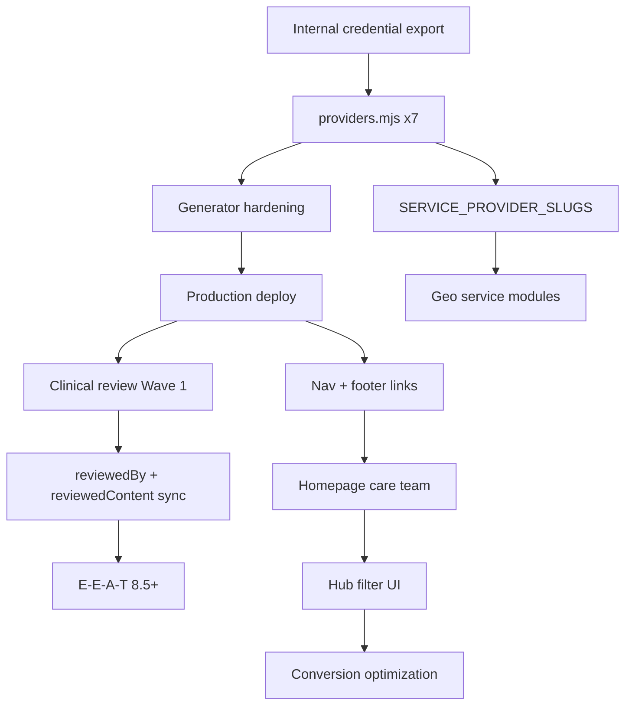

# Provider Expansion Master Plan

**Siya Health — Production Launch & E-E-A-T Authority Build**  
**Generated:** 2026-06-02  
**Status:** Execution plan (assumes internal credentialing complete; no new intake forms)

---

## Executive summary

Siya Health has a **production-certified generator stack** (155 URLs, 0 broken links, 0 JSON-LD errors) built around `data/providers.mjs`. The site today surfaces **3 physicians**; the contracted roster is **7 clinicians** (4 physicians + 3 advanced practice providers).

This plan moves from “3-provider telehealth clinic” to **scalable multi-provider organization** by:

1. Hardening the data model and generator for **physician + APP** types  
2. Populating all seven profiles from **internal records** (not public enrichment)  
3. Rebuilding **discoverability** (nav, homepage, hub, guides, blogs)  
4. Launching **reviewed-content registry** in phased, high-traffic waves  
5. Optimizing **conversion** on hub, profiles, and service pages  

**Target end state:** 162 URLs (+7 profiles), hub with filterable directory, every provider ≤2 clicks from `/`, cornerstone content clinically reviewed by scope-appropriate clinicians, E-E-A-T score **7.5/10 → 9/10**.

**Reference audits (do not duplicate):**  
`PROVIDER-DISCOVERABILITY-AUDIT.md` · `FUTURE-PROVIDER-ENRICHMENT-AUDIT.md` · `PROVIDER-PHASE2-3-GENERATOR-REPORT.md` · `PROVIDER-PUBLISHING-MINIMUMS.md` · `PROVIDER-SCHEMA-STRATEGY.md`

---

## SECTION 1 — Provider System Readiness

### What is production-ready today

| Component | Status | Evidence |
|-----------|--------|----------|
| `data/providers.mjs` canonical model | **Ready** (3 entries) | Generator, schema, service cards consume one source |
| `scripts/generate-provider-pages.mjs` | **Ready** | Profiles + `/providers` index, Physician + ProfilePage JSON-LD |
| `scripts/generate-provider-audit-docs.mjs` | **Ready** | Auto-audit on build |
| Build pipeline wiring | **Ready** | `package.json` / `vercel.json` run generator before `seo-build` |
| `SERVICE_PROVIDER_SLUGS` + `site-chrome.mjs` | **Ready** (4 service keys) | `#meet-physicians` on adhd-care, telehealth, weight-loss, mens-health |
| `content-review-registry.mjs` governance | **Ready** (empty allowlist) | Pending review default; safe to enable reviews |
| `clinical-entity.mjs` + entity graph | **Ready** | Provider `@id` anchors; `reviewedBy` gated on registry |
| Provider hub `/providers` | **Live** | Sitemap, CollectionPage ItemList, breadcrumbs |
| Trust cleanup (Phase 1) | **Certified** | No duplicate states, legal links normalized |
| QA gates | **Passing** | 155 URLs, 0 broken links, 0 JSON-LD errors |

### What blocks launch of remaining providers (Vanessa, Megan, Derek, Wendy)

| Blocker | Severity | Resolution |
|---------|----------|------------|
| Only 3 objects in `PROVIDERS[]` | **P0** | Add 4 entries + populate from internal HR/credentialing export |
| Schema `@type: Physician` for all | **P0** | Add `providerType` + emit `Nurse`/`Physician` dual-type or `PhysicianAssistant` where appropriate |
| Hub copy “Our physicians” only | **P1** | Section physicians vs APP; inclusive H1/meta |
| `SERVICE_PROVIDER_SLUGS` covers 4 pages only | **P0** | Map new providers to services + states (no cross-state implication) |
| `credentialStatus` still “pending” on live 3 | **P0** | Set `verified` + `credentialVerifiedBy/Date` from internal sign-off |
| `licenses[]`, `education`, `npi`, `sameAs` empty | **P0** | Populate from internal records before publish |
| `claimsNeedingVerification` (5,000+, testimonials) | **P1** | Resolve with documentation or remove before expansion deploy |
| Global nav / footer lack `/providers` | **P1** | `site-chrome.mjs` sitewide (see Section 7) |
| `crossLinks()` lists all other providers | **P2** | Cap at 3 related providers when roster = 7 |
| `reviewedContent[]` empty everywhere | **P2** | Blocks badges—not profile publish (see Section 6) |
| Headshots for 4 new clinicians | **P0** | `assets/images/<slug>.png` |
| Generator + 4 profiles **undeployed** if prod still at 3 | **P0** | Single production deploy after data population |

### What to implement **before** publishing Vanessa, Megan, Derek, Wendy

**Must ship in code (Sprint 1):**

1. `providerType`: `physician` | `advanced-practice`  
2. `providerCategory`: `physician` | `np` | `pa` (for schema + filters)  
3. `sortOrder`, `featured`, `hubSection` fields  
4. Generator: schema type switch, hub sections, filter metadata (`data-state`, `data-focus`)  
5. `SERVICE_PROVIDER_SLUGS` expansion (Section 5)  
6. `toEntityGraphProvider()` + `provider-index.json` for 7 providers  
7. Sitewide nav item “Our providers” → `/providers`  

**Must complete in data (Sprint 1):**

8. Full profile objects for all 7 with `credentialStatus: 'verified'`  
9. Per-state `licenses[]` with board URLs from internal compliance  
10. `acceptingNewPatients` per state  
11. APP-appropriate disclaimers (supervision, scope) where required  

### Reviewed-content architecture readiness

| Piece | Ready? | Note |
|-------|--------|------|
| Registry allowlist | Yes | `CLINICAL_REVIEW_APPROVED` empty by design |
| `reviewerSlug` in seeds | Yes | Maps to existing 3 slugs only—extend for Derek/Megan/Wendy/Vanessa |
| Profile `reviewedContent[]` inverse list | Yes | Generator renders when populated |
| Blog `reviewedBy` in `seo-build` | Yes | Gated on registry |
| APP as clinical reviewer on ADHD diagnosis content | **Policy decision** | ADHD medical content → physicians/NPs with ADHD scope; weight GLP-1 → Derek/Wendy |

---

## SECTION 2 — Provider Data Population Plan

Populate **`data/providers.mjs` only** from internal credentialing, HR, and approved marketing copy. No intake forms.

### Field taxonomy (all providers)

| Category | Fields | Populate from internal records |
|----------|--------|----------------------------------|
| **Required** | `slug`, `name`, `displayName`, `givenName`, `familyName`, `credentials`, `role`, `photo`, `altText`, `statesLicensed`, `stateAbbreviations`, `licenses[]`, `boardCertifications`, `clinicalFocus`, `services`, `shortBio`, `carePhilosophy`, `patientFit`, `credentialStatus`, `credentialVerifiedBy`, `credentialVerifiedDate`, `profileLastUpdated`, `acceptingNewPatients`, `bookingLink`, `seo`, `schema`, `disclaimer` | **Yes — day 1** |
| **Optional** | `languages`, `fellowship`, `professionalMemberships`, `telehealthDisclaimer`, `relatedLinksHtml`, `showScreeningCta` | Yes when available |
| **E-E-A-T enhancing** | `education`, `residency`, `longBio`, `npi`, `sameAs`, `authoredContent`, `whatToExpect`, `trustCards`, `credentialChips` | **Yes — day 1** (bios/headshots pre-approved) |
| **Schema** | `schema.medicalSpecialty`, `schema.knowsAbout`, `schema.jobTitle`, `areaServed` (via states), `hasCredential` (from board certs), `alumniOf` (from education) | **Yes — day 1** |
| **Trust signals** | `licenses[].verificationUrl`, `acceptingNewPatients`, verified testimonials only, `claimsNeedingVerification: []` when clean | **Yes — compliance sign-off** |
| **Governance** | `reviewedContent[]`, `claimsNeedingVerification` | Sprint 2+ (reviews); resolve claims Sprint 1 |

### Per-provider population matrix

#### Dr. Sneh Pandey, MD — Medical Director (existing — **backfill**)

| Populate immediately | Notes |
|---------------------|-------|
| `licenses[]` (CA, TX, PA, FL) | Internal board URLs |
| `education`, `residency` | Internal CV |
| `npi`, `sameAs` | NPPES + approved profiles |
| `credentialStatus: verified` | Compliance officer + date |
| `acceptingNewPatients: true` (per state) | Scheduling rules |
| Resolve `claimsNeedingVerification` | 5,000+ volume + testimonials |

**Authority role:** Adult ADHD · Obesity Medicine · Metabolic Health · GLP-1 · Medical Director

---

#### Dr. Vanessa Urbina, MD — Physician (new)

| Populate immediately | Notes |
|---------------------|-------|
| Full identity + FL license(s) | Internal records |
| `providerType: physician`, `slug: dr-vanessa-urbina` | |
| `boardCertifications`, `education`, `residency` | University of Miami path per internal CV |
| `clinicalFocus`: primary care, family medicine, lifestyle, ADHD, weight | Approved copy |
| `services`: `/primary-urgent-care`, `/adhd-care`, `/telehealth`, `/weight-loss-metabolic-health` | State-gated FL |
| `statesLicensed`: Florida only unless internal shows more | |
| Headshot `assets/images/dr-vanessa-urbina.png` | |
| `hubSection: physicians`, `sortOrder: 2`, `featured: true` | Tier 1 physician |

**Authority role:** Primary Care · Family Medicine · Lifestyle Medicine · ADHD (primary care scope)

---

#### Dr. Natasha Desai, MD — Physician (existing — **backfill**)

| Populate immediately | Same backfill pattern as Sneh |
| `statesLicensed`: TX, FL | |
| Resolve testimonial claims | |

**Authority role:** Behavioral Health · ADHD · Anxiety · Emotional dysregulation

---

#### Dr. Swati Pandey, MD — Physician (existing — **backfill**)

| Populate immediately | Same backfill + `telehealthDisclaimer` (988/911) |
| `statesLicensed`: PA | |

**Authority role:** Psychiatry · Depression · Anxiety · Complex medication management · ADHD

---

#### Megan Wunderlich, FNP-C — Advanced Practice (new)

| Populate immediately | Notes |
|---------------------|-------|
| `providerType: advanced-practice`, `providerCategory: np` | |
| `slug: megan-wunderlich`, `name: Megan Wunderlich, FNP-C` | |
| `licenses[]` (states from internal—e.g. PA + any expansion) | |
| `education` (BSN, MSN, PMC-FNP) | Internal CV |
| `npi: 1629930532` (if confirmed internal) | |
| `clinicalFocus`: ADHD support, family medicine, mental health telehealth | |
| `services`: `/adhd-care`, `/telehealth` | State chips only |
| `schema`: `@type` Nurse + `medicalSpecialty` Family Practice / Mental Health | |
| Supervision disclaimer if required by state | Legal template |
| `hubSection: advanced-practice`, `sortOrder: 10` | |

**Authority role:** ADHD Support · Family Medicine · Telehealth mental health

---

#### Derek Timbs, FNP-BC — Advanced Practice (new)

| Populate immediately | Notes |
|---------------------|-------|
| `slug: derek-timbs`, `providerCategory: np` | |
| `licenses[]` TX, OH (per internal) | |
| `education`: Texas A&M Corpus Christi MSN FNP | |
| `npi: 1609886910` (if confirmed) | |
| `clinicalFocus`: weight loss, GLP-1, hormone optimization, preventive medicine | |
| `services`: `/weight-loss-metabolic-health`, `/mens-health-longevity`, `/telehealth` | |
| `hubSection: advanced-practice`, `featured: true`, `sortOrder: 11` | |

**Authority role:** Weight Loss · Hormone Optimization · Men's Health · GLP-1 / phentermine (state-specific)

---

#### Wendy Delgado, PA-C — Advanced Practice (new)

| Populate immediately | Notes |
|---------------------|-------|
| `slug: wendy-delgado`, `providerCategory: pa` | |
| `licenses[]` per internal (CA + any Siya-active states) | |
| `education`: Western University PA program | |
| `npi: 1063725059` (if confirmed) | |
| `clinicalFocus`: medical weight loss, GLP-1 telehealth, lifestyle | **Exclude aesthetics** unless Siya offers |
| `services`: `/weight-loss-metabolic-health`, `/telehealth` | |
| `schema`: PhysicianAssistant or appropriate dual typing | |
| `hubSection: advanced-practice`, `sortOrder: 12` | |

**Authority role:** Weight Loss Support · Telehealth · GLP-1 intake/monitoring

---

### Data population sequence (recommended)

1. **Compliance export** → JSON template matching `providers.mjs` shape  
2. **Backfill Sneh, Natasha, Swati** → `verified` status  
3. **Add Vanessa, Megan, Derek, Wendy** → full objects  
4. **Run** `generate-provider-pages.mjs` + `generate-provider-audit-docs.mjs`  
5. **QA** provider QA checklist + `npm run build`  
6. **Deploy** single production release  

---

## SECTION 3 — Provider Directory Optimization (`/providers`)

### Current state (from discoverability audit)

- Flat grid of 3 cards; H1 “Our physicians”  
- Hub linked from **8 URLs** only; not in global nav  
- No filtering; no APP section  
- `llms.txt` omits hub URL  

### Recommended final layout

```
┌─────────────────────────────────────────────────────────┐
│  H1: Our care team                                      │
│  Lead: Licensed physicians and advanced practice        │
│        providers—telehealth where listed, never implied │
│  CTAs: Book Meet & Greet | Explore ADHD | Weight loss   │
├─────────────────────────────────────────────────────────┤
│  Filter bar (client-side):                            │
│  [All] [Physicians] [NPs & PAs]                         │
│  State: [CA][TX][PA][FL][OH]…                           │
│  Focus: [ADHD][Weight][Psychiatry][Primary care]…       │
├─────────────────────────────────────────────────────────┤
│  ## Physicians (4)                                      │
│  Featured card row — photo, role, states, focus tags    │
│  Sneh (featured) | Vanessa | Natasha | Swati            │
├─────────────────────────────────────────────────────────┤
│  ## Advanced practice providers (3)                     │
│  Megan | Derek | Wendy                                  │
├─────────────────────────────────────────────────────────┤
│  Trust strip: HIPAA | LegitScript | State disclaimer    │
│  Conversion: “Not sure who to see?” → Meet & Greet      │
└─────────────────────────────────────────────────────────┘
```

### Filtering strategy

| Filter | Implementation | Source field |
|--------|----------------|--------------|
| Role | `data-provider-type` on cards | `providerType` |
| State | `data-states="CA,TX"` | `stateAbbreviations` |
| Clinical focus | `data-focus="adhd,weight,psychiatry"` | normalized tags from `clinicalFocus` |
| Accepting patients | optional badge | `acceptingNewPatients` |

Use **client-side filter** (no new URLs) for v1; avoid `/providers?state=TX` until analytics justify SSR.

### Conversion opportunities on hub

- Sticky “Book Meet & Greet” after hero  
- State-aware microcopy: “Showing clinicians licensed in **Texas**” when filter active  
- Link chips to top service pages per focus  
- “Compare our ADHD team” → `/adhd-care#meet-physicians`  

### URL recommendation: `/providers` vs `/our-providers`

| Option | Pros | Cons |
|--------|------|------|
| **Keep `/providers`** | Canonical in sitemap, breadcrumbs, 8 inbound links, generator paths, JSON-LD ItemList | Label “physicians” dated |
| Move to `/our-providers` | Slightly clearer UX label | 301 chain, regenerate all internal links, breadcrumb/schema churn, hub equity reset |

**Recommendation: Keep `/providers`.** Update visible copy to **“Our care team”** / **“Our providers”** while retaining URL. Add `alternateName` in CollectionPage schema if desired. Do **not** migrate URL during expansion sprint.

---

## SECTION 4 — Provider Profile Optimization

### Current template audit (generator)

| Module | Current | Production recommendation |
|--------|---------|-------------------------|
| **Hero** | H1 = name; emotional `provider-lp-hero-lead`; photo; state chips; credential chips | Keep. Add **role line** + **accepting patients** badge. APP pages: add supervision line under role |
| **Credential card** | Board list + trust cards | Add **verified education block** (school, residency) from internal data. Link board certs to verification URLs where public |
| **State chips** | Per-state names | Keep strict—never show states not in `licenses[]` |
| **Care philosophy** | 2 paragraphs | Keep; physician-approved only |
| **Clinical focus** | Bullet list (HTML allowed) | Keep; add anchor IDs for filter tag extraction |
| **Conditions treated** | List + schema `knowsAbout` | Keep |
| **Services** | Linked chips to service pages | Add **“Book for this service”** deep link with UTM |
| **What to expect** | 4-step list | Customize per provider type (APP vs MD evaluation length) |
| **Trust strip** | 3 trust cards | Standardize: Licensure · HIPAA · State law disclaimer. **Remove unverified testimonial “verified” label** until documented |
| **Testimonials** | 2 quotes if present | **Gate:** only render when `needsVerification: false` |
| **CTA architecture** | Inline + final CTA band | See Section 8 |
| **Cross-links** | All other providers in footer | **Max 3** related by `services` overlap + hub link |
| **Reviewed content** | Section if `reviewedContent.length` | Auto-sync from registry in build (Sprint 2) |
| **SEO** | Per-provider title/description | APP titles: “FNP-C” / “PA-C” explicit |

### Final production layout order

1. Breadcrumb  
2. Hero (identity + states + primary CTA)  
3. Credential + education panel  
4. Clinical focus + conditions  
5. Care philosophy + patient fit  
6. What to expect  
7. Services supported at Siya  
8. Trust strip  
9. Reviewed articles & guides (when live)  
10. Related providers (3 cards)  
11. Final CTA  
12. Disclaimer  

---

## SECTION 5 — Provider Authority Architecture

### Authority matrix

| Provider | Tier | Service ownership | Guide cluster ownership | Blog cluster ownership | Reviewer priority |
|----------|------|-------------------|-------------------------|------------------------|-------------------|
| **Sneh** | Flagship MD | ADHD, weight, metabolic, men's health, telehealth | Metabolic, GLP-1, food noise, insulin, testosterone, ADHD eval cost | GLP-1, semaglutide, tirzepatide, ADHD CA/TX, weight-loss cornerstone | **Primary** — metabolic + ADHD flagship |
| **Vanessa** | Core MD | Primary/urgent, ADHD (FL), telehealth, lifestyle | Primary care, lifestyle, prevention | ADHD FL, primary care, chronic disease | FL primary + ADHD secondary |
| **Natasha** | Core MD | ADHD, telehealth (TX/FL) | ADHD vs anxiety, burnout, sleep, emotional | ADHD symptoms, non-stimulant, insomnia, lazy-signs blog | **Primary** — behavioral ADHD guides |
| **Swati** | Core MD | ADHD, telehealth (PA) | Psychiatric comorbidity, med safety, depression/anxiety | ADHD medication safety, side effects, prescribing online | **Primary** — psychiatric ADHD/med content |
| **Megan** | Core NP | ADHD support, telehealth | Screening vs eval, telehealth expectations | ADHD screening, family medicine adjunct | ADHD support content (non-diagnosis claims) |
| **Derek** | Core NP | Weight loss, men's health, telehealth (TX/OH) | GLP-1 qualification, phentermine, TRT monitoring | Semaglutide, GLP-1 side effects, testosterone therapy | **Primary** — weight + men's metabolic |
| **Wendy** | Supporting PA | Weight loss, telehealth | GLP-1 side effects, food noise, compounded vs branded | Weight loss how-tos, GLP-1 patient education | Weight loss support (PA scope) |

### `SERVICE_PROVIDER_SLUGS` (target)

```javascript
{
  'adhd-care': ['dr-sneh-pandey', 'dr-natasha-desai', 'dr-swati-pandey', 'dr-vanessa-urbina', 'megan-wunderlich'],
  telehealth: ['dr-sneh-pandey', 'dr-natasha-desai', 'dr-swati-pandey', 'dr-vanessa-urbina', 'megan-wunderlich', 'derek-timbs', 'wendy-delgado'],
  'weight-loss-metabolic-health': ['dr-sneh-pandey', 'dr-vanessa-urbina', 'derek-timbs', 'wendy-delgado'],
  'mens-health-longevity': ['dr-sneh-pandey', 'derek-timbs'],
  'primary-urgent-care': ['dr-vanessa-urbina'],
}
```

**Rules:** Service-page cards filter by page key; state chips on card must match provider licenses—generator already uses `stateChipLabel()`. Geo ADHD landing pages inherit parent service assignment in Sprint 2.

### Article / guide ownership rules

1. **One primary reviewer** per URL in `content-review-registry.mjs`  
2. Reviewer must be **licensed in topic state** when content is state-specific  
3. ADHD **diagnosis** content → MD or NP with ADHD-CCSP/equivalent only  
4. GLP-1 **prescribing** content → obesity-certified MD/NP or PA under protocol  
5. Psychiatric medication content → Swati (or Sneh when psychiatric scope not needed)  
6. `reviewedContent[]` on profile auto-derived from registry inverse map at build  

---

## SECTION 6 — Reviewed Content Strategy

### Architecture (production-ready)

```
content-review-registry.mjs (allowlist)
        ↓
seo-build / generate-answer-pages → reviewedBy JSON-LD + UI badge
        ↓
providers.mjs reviewedContent[] ← build script sync
        ↓
Profile “Clinically reviewed articles” section
```

**Default:** All ~110 educational pages remain `PENDING_REVIEW` until allowlisted.

### Provider → Service → Cluster map (priority waves)

#### Wave 1 — Highest traffic (publish reviews in Sprint 2)

| Cluster | Top URLs (inbound links) | Primary reviewer | Secondary |
|---------|-------------------------|------------------|-----------|
| **GLP-1 / weight** | `/blog/food-noise-and-glp-1-…`, `/blog/glp1-side-effects…`, `/answers/what-is-food-noise`, `/answers/glp-1-side-effects`, `/answers/who-qualifies-glp-1-weight-loss` | Derek or Sneh | Wendy (patient education) |
| **ADHD eval / cost** | `/adhd-care`, `/answers/what-included-199-adhd-evaluation`, `/blog/adhd-evaluation-cost-texas`, `/blog/online-adhd-diagnosis-texas` | Sneh | Natasha |
| **ADHD medication** | `/blog/how-adhd-medication-is-prescribed-online`, `/answers/can-you-get-adhd-medication-online`, `/blog/adhd-medication-side-effects-what-to-expect` | Swati | Sneh |
| **Telehealth trust** | `/answers/is-telehealth-legitimate`, `/answers/telehealth-adhd-california`, `/blog/telehealth-prescriptions-how-online-treatment-works` | Sneh | Megan |

#### Wave 2 — Sprint 3

| Cluster | URLs | Reviewer |
|---------|------|----------|
| Testosterone / men's | `/blog/when-is-testosterone-therapy-appropriate`, `/answers/when-is-testosterone-therapy-appropriate`, `/answers/what-is-free-testosterone` | Derek / Sneh |
| ADHD behavioral | `/blog/youre-not-lazy-signs-undiagnosed-adult-adhd`, `/answers/adhd-vs-burnout`, Natasha-owned seeds | Natasha |
| Sleep / fatigue | `/blog/why-am-i-always-tired…`, `/answers/poor-sleep-feels-like-adhd` | Sneh |
| Primary / lifestyle | `/primary-urgent-care`, chronic disease guides | Vanessa |

#### Remain pending (do not rush)

- Off-scope meds (modafinil, ambien, minoxidil) until specialist reviewer assigned  
- State geo pages until state-licensed reviewer confirmed  
- Any content assigning reviewerSlug to provider not yet in registry with signed review date  

### First 15 URLs to clinically review (recommended)

1. `/adhd-care` (MedicalWebPage treatment) — Sneh  
2. `/weight-loss-metabolic-health` — Derek  
3. `/blog/food-noise-and-glp-1-what-it-means-and-what-helps` — Sneh  
4. `/blog/glp1-side-effects-and-how-to-manage-them` — Derek  
5. `/answers/what-is-food-noise` — Sneh  
6. `/answers/who-qualifies-glp-1-weight-loss` — Derek  
7. `/answers/what-included-199-adhd-evaluation` — Sneh  
8. `/blog/how-adhd-medication-is-prescribed-online` — Swati  
9. `/answers/is-telehealth-legitimate` — Sneh  
10. `/answers/telehealth-adhd-california` — Sneh (+ add profile link)  
11. `/blog/adhd-evaluation-cost-texas` — Sneh  
12. `/blog/online-adhd-diagnosis-texas` — Natasha  
13. `/answers/screening-vs-adhd-evaluation` — Megan  
14. `/blog/youre-not-lazy-signs-undiagnosed-adult-adhd` — Natasha  
15. `/answers/adhd-medication-side-effects` — Swati  

---

## SECTION 7 — Internal Linking Expansion

Baseline: hub **8** inbound links; no homepage/nav/footer hub link; Natasha/Swati **2-click** from `/`; guides/blogs largely unlinked to providers.

### Recommended additions (by surface)

| Surface | Addition | Providers benefited |
|---------|----------|---------------------|
| **Global nav** | “Our providers” → `/providers` | All 7 |
| **Global footer** | Services column: “Our providers” | All 7 |
| **Homepage `/`** | New `#care-team` grid (4 physicians + 3 APP) + link to hub | All 7 |
| **Homepage** | Link testimonial “Dr. Pandey” → `/providers/dr-sneh-pandey` | Sneh |
| **About `/about`** | “View full care team” → `/providers` | All 7 |
| **Service pages** | `#meet-physicians` on 13 ADHD geo pages + `primary-urgent-care` | State-filtered subset |
| **Membership pricing** | “Meet your clinicians” strip | All 7 |
| **Blog templates** | Author footer: “Reviewed by [Provider]” when registry active; else “Care team” link | Reviewers |
| **Health guides** | Bottom CTA: “Provided by Siya licensed clinicians” + link to most relevant profile | Per `reviewerSlug` |
| **High-traffic answers** | Inline link first mention of Medical Director / clinician | Sneh + specialists |
| **`llms.txt`** | Add hub URL + all 7 profile URLs | AI visibility |
| **`provider-index.json`** | Add `hubUrl`, all 7 entries | Machine-readable |

### Internal link targets (90-day)

| Provider | Current inbound | Target inbound |
|----------|----------------:|---------------:|
| `/providers` hub | 8 | **35+** |
| Dr. Sneh | 9 | **25+** |
| Dr. Natasha | 6 | **18+** |
| Dr. Swati | 6 | **18+** |
| New profiles | 0 | **12+** each |

### Implementation owner

`scripts/site-chrome.mjs` for nav/footer/service modules; `index.html` + `about.html` hand edits or chrome injection markers; registry-driven guide footers in `seo-build.mjs`.

---

## SECTION 8 — Conversion Architecture

### Homepage

| Module | Recommendation |
|--------|----------------|
| Provider module | 7-card compact grid above final CTA; “Meet the team” → `/providers` |
| Trust blocks | LegitScript + HIPAA + “7 licensed clinicians” (count from mjs) |
| Meet & Greet | Hero secondary CTA + post-provider-module CTA |
| Founder block | Keep Sneh feature; add “View all providers” |

### Provider pages

| Element | Hierarchy |
|---------|-----------|
| Primary CTA | Book Meet & Greet (sticky on mobile) |
| Secondary | Free ADHD screening (if `showScreeningCta`) |
| Tertiary | Service chips (ADHD, weight, etc.) |
| Cross-provider | “Other clinicians who treat [focus]” — 3 cards max |
| Social proof | Testimonials only when verified |

### Service pages

| Element | Recommendation |
|---------|----------------|
| Provider cards | State-filtered; show accepting-new-patients |
| Trust | “Licensed in [states served on this page]” dynamic copy |
| Conversion module | After cards: pricing link + Meet & Greet |
| Geo pages | Same module with geo-filtered providers (e.g. TX → Natasha, Sneh, Derek) |

---

## SECTION 9 — E-E-A-T Audit

Scoring **1–10** per dimension (qualitative, based on current audits + projected state).

### Current state (3 providers live, registry empty)

| Dimension | Score | Rationale |
|-----------|------:|-----------|
| **Experience** | 6 | Strong founder narrative; thin education/license on profiles; testimonials unverified |
| **Expertise** | 7 | ADHD-CCSP, specialty chips credible; missing school/residency on site |
| **Authoritativeness** | 5 | 3 profiles only; hub buried; 110 pages “pending review”; no named reviewers live |
| **Trustworthiness** | 7 | Phase 1 trust cleanup done; governance system exists; claims still need proof |
| **Composite E-E-A-T** | **6.25** | |

### Projected after full expansion + linking + reviews

| Dimension | Score | Lift drivers |
|-----------|------:|--------------|
| **Experience** | 8 | 7 profiles with education, licenses, headshots, practice scope |
| **Expertise** | 9 | Specialty-matched reviewers on top 15+ URLs; APP/MD differentiation |
| **Authoritativeness** | 9 | Hub in nav; 7 entities in entity graph; guide/blog reviewer linkage |
| **Trustworthiness** | 9 | Verified credentials; claims resolved; transparent pending review elsewhere |
| **Composite E-E-A-T** | **8.75** | |

### After Wave 2 reviews + geo linking (steady state)

**Target composite: 9/10** — competitive with multi-provider telehealth brands; remaining gap is third-party reputation (Healthgrades, press) and longitudinal content freshness.

---

## SECTION 10 — Execution Plan

### Sprint 1 — Foundation & publication (2 weeks)

**Goal:** 7 provider profiles live; verified data; hub v2; deploy to production.

| Task | Owner | Depends on |
|------|-------|------------|
| Extend `providers.mjs` schema (`providerType`, `hubSection`, `sortOrder`) | Eng | — |
| Compliance JSON export → populate all 7 providers | Ops/Clinical | Internal records |
| Resolve claims on Sneh testimonials / 5,000+ | Marketing/Legal | Documentation |
| Add 4 headshots to `assets/images/` | Design | Photos |
| Update generator: APP schema types, hub sections, filters | Eng | Schema extension |
| Expand `SERVICE_PROVIDER_SLUGS` | Eng | Data |
| Backfill `licenses[]`, `npi`, `education` on all 7 | Ops | Compliance export |
| Run full build QA (0 broken links, 0 JSON-LD errors) | Eng | Generator |
| Production deploy | Eng | QA pass |
| Add `/providers` to global nav + footer (`site-chrome.mjs`) | Eng | Deploy |

| Impact | Expected outcome |
|--------|------------------|
| **SEO** | +7 URLs indexed; hub ItemList ×7; entity graph completeness |
| **E-E-A-T** | 6.25 → **7.5** (verified credentials visible) |
| **Conversion** | Service pages show expanded roster; hub discoverable from nav |

---

### Sprint 2 — Authority & linking (2–3 weeks)

**Goal:** Every provider is a high-authority internal entity; Wave 1 clinical reviews live.

| Task | Owner | Depends on |
|------|-------|------------|
| Homepage `#care-team` module (7 providers) | Eng/Design | Sprint 1 deploy |
| About page hub link + team refresh | Eng | Sprint 1 |
| `#meet-physicians` on 13 ADHD geo + primary-urgent-care | Eng | `SERVICE_PROVIDER_SLUGS` |
| Fix orphan mentions (`telehealth-adhd-california`, testimonials) | Eng | — |
| Populate Wave 1 `CLINICAL_REVIEW_APPROVED` (15 URLs) | Clinical | Signed reviews |
| Build script: sync `reviewedContent[]` from registry | Eng | Registry |
| Extend `answer-seeds.mjs` reviewerSlug for Derek, Megan, Wendy, Vanessa | Eng | Slug list |
| Enrich schema: `alumniOf`, `hasCredential`, provider `image` OG tags | Eng | Education data |
| Update `llms.txt` + `provider-index.json` | Eng | 7 profiles |

| Impact | Expected outcome |
|--------|------------------|
| **SEO** | Reviewed snippets; stronger internal link graph; hub inbound 35+ |
| **E-E-A-T** | 7.5 → **8.5** (live `reviewedBy` on cornerstone content) |
| **Conversion** | Guide CTAs → profiles; geo pages show state clinicians |

---

### Sprint 3 — Optimization & scale (2–3 weeks)

**Goal:** Conversion architecture mature; Wave 2 reviews; monitoring.

| Task | Owner | Depends on |
|------|-------|------------|
| Hub client-side filters (state, focus, role) | Eng | Sprint 1 hub |
| Profile template: education panel, related providers cap, testimonial gate | Eng | — |
| Wave 2 clinical reviews (20+ URLs) | Clinical | Wave 1 process |
| Blog author footer component (reviewed vs care team link) | Eng | Registry |
| Membership-pricing provider strip | Eng | — |
| Cross-provider recommendation logic by `services` overlap | Eng | Data |
| Production certification doc + monitor GSC rich results | SEO | — |
| Quarterly credential recheck workflow in `credentialStatus` | Ops | — |

| Impact | Expected outcome |
|--------|------------------|
| **SEO** | Improved crawl depth to profiles; filter engagement metrics |
| **E-E-A-T** | 8.5 → **9** |
| **Conversion** | Measurable Meet & Greet lift from provider module A/B |

---

## Dependencies graph



---

## Success metrics

| Metric | Baseline | Sprint 1 | Sprint 3 |
|--------|----------|----------|----------|
| Provider profiles indexed | 3 | 7 | 7 |
| Hub inbound internal links | 8 | 20 | 35+ |
| Clinically reviewed URLs | 0 | 15 | 35+ |
| Providers ≤2 clicks from `/` | 3/3 | 7/7 | 7/7 |
| Sitemap URLs | 155 | 162 | 162+ |
| JSON-LD errors | 0 | 0 | 0 |
| Composite E-E-A-T (est.) | 6.25 | 7.5 | 9.0 |

---

## Out of scope for this sprint

- Provider intake forms or external enrichment re-research  
- New provider #8+  
- `/our-providers` URL migration  
- Aggregate star ratings / third-party review widgets without source contract  
- `reviewedBy` on content without registry + signed review date  

---

## Document index

| Doc | Use in sprint |
|-----|---------------|
| `PROVIDER-EXPANSION-MASTER-PLAN.md` | **This file** — execution source of truth |
| `PROVIDER-DISCOVERABILITY-AUDIT.md` | Linking baseline |
| `PROVIDER-PUBLISHING-MINIMUMS.md` | Publish gates (superseded by internal records assumption for new 4) |
| `PROVIDER-SCHEMA-STRATEGY.md` | Sprint 2 schema enrichment |
| `PROVIDER-PHASE2-3-GENERATOR-REPORT.md` | Generator QA checklist |
| `PROVIDER-SCALING-STRATEGY.md` | Field usage reference |
| `FUTURE-PROVIDER-ENRICHMENT-AUDIT.md` | External research archive only—not publish source |
