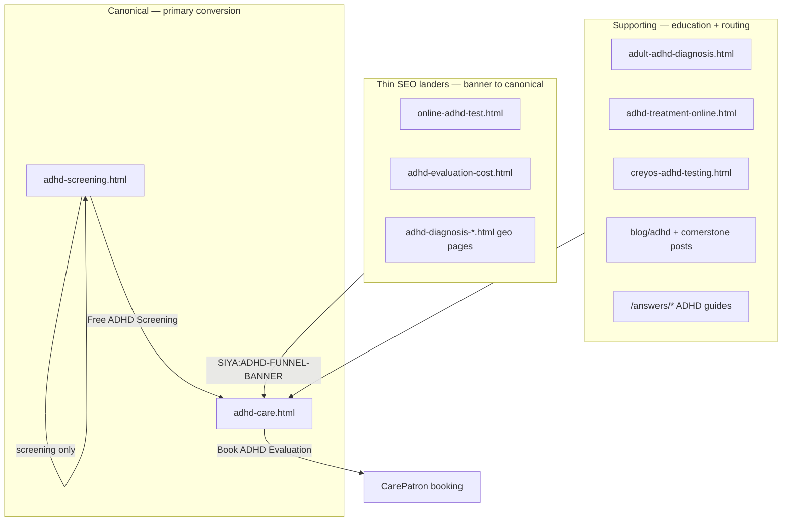

# UX CTA Cleanup — P0/P1 Implementation Report

Generated: 2026-06-06

## Executive summary

Implemented sitewide CTA hierarchy, removed duplicate booking modules, simplified ADHD funnel navigation, upgraded Health Guide trust badges, and cleaned up `/telehealth`—without new pages, URL changes, or SEO structure edits.

**Success metrics (measured):**

| Metric | Before | After | Δ |
|--------|-------:|------:|--:|
| Total `class="button"` | 925 | 704 | **−24%** |
| Booking URL refs | 699 | 507 | **−27%** |
| Homepage buttons | 13 | 9 | −31% |
| Telehealth booking refs | 13 | 5 | **−62%** |
| Telehealth buttons | 12 | 6 | −50% |
| Provider page buttons (8 pages) | 75 | 53 | −29% |
| Blog buttons | 323 | 240 | −26% |
| Health Guide buttons | 297 | 232 | −22% |

---

## Phase 1 — CTA cleanup

### Before audit

See [`UX-CTA-AUDIT-BEFORE.md`](./UX-CTA-AUDIT-BEFORE.md).

### CTA hierarchy implemented

| Page type | Primary | Secondary |
|-----------|---------|-----------|
| Homepage | Talk to a Clinician | Find the Right Starting Point (`#symptoms`) |
| ADHD funnels | Book ADHD Evaluation | Free ADHD Screening (`/adhd-screening`) |
| Provider pages | Book with {Name} | View Services (`#services-supported`) |
| Health Guides | Talk to a Clinician (single end CTA) | — |
| Blogs | Talk to a Clinician / Book ADHD Evaluation (single end band) | — |

### Duplicate modules removed

- **Meet our care team** cards: per-card “Book Meet & Greet” → `View profile →` (sitewide via `buildMeetPhysiciansBlock`)
- **Homepage**: removed care-team button row + testimonial button band (text link instead)
- **Blogs**: stripped mid-article `cta-block blog-cta--mid`; one `blog-final-cta` only
- **Health Guides**: single `answer-final-cta`; educational `next-steps` only (no booking links)
- **Provider pages**: hero + final band only; removed treatment-section booking row; inline service links → text links
- **FAQ accordion CTAs**: button → text link (“Talk to a clinician when you're ready →”)
- **Footer**: removed duplicate “Book a Meet & Greet” service-column links (sitewide normalize)

### Max 3 branded buttons per viewport

Hero + nav + one in-page band now typical pattern. Provider cards no longer add 7 parallel booking buttons on service pages.

---

## Phase 2 — ADHD funnel simplification

### Funnel map

### Recommendations (implemented without URL changes)

| Role | Pages |
|------|-------|
| **Canonical** | `/adhd-care`, `/adhd-screening` |
| **Supporting** | `/adult-adhd-diagnosis`, `/adhd-treatment-online`, `/creyos-adhd-testing`, ADHD blogs & Health Guides |
| **Thin SEO** | `/online-adhd-test`, `/adhd-evaluation-cost`, `/adhd-diagnosis-{state,city}` — banner points to `/adhd-care` |

Nav on ADHD funnels: **Book ADHD Evaluation** (primary nav CTA).

---

## Phase 3 — Visual consistency

| System | Before | After |
|--------|--------|-------|
| Hero | `hero-merged` + legacy `hero-fullwidth` | Standardized on **`hero-merged`** for primary service pages |
| Fonts | 5 pages on Merriweather | **Poppins + Inter** on `primary-urgent-care`, `labs`, `prescriptions`, `book-appointment`, `mens-health-longevity` |
| Trust bars | `hero-trust-bar` sitewide | Unchanged — one pattern |
| CTA bands | Duplicate mid + final bands | **One `cta-band` system** per page type |
| Provider cards | Mixed button + text | **One card system**: photo, name, tagline, `View profile →` |
| Meet-physicians | Per-card booking | Profile links only |

---

## Phase 4 — Health Guides trust upgrade

### Pending review report

See [`UX-PENDING-REVIEW-REPORT.md`](./UX-PENDING-REVIEW-REPORT.md).

- **121** guides still flagged for physician review workflow
- **Badge change:** `Pending physician review` → **`Clinician-informed`**
- **Copy:** “Educational content informed by clinical practice patterns—not personal medical advice.”
- **Top 20 review priority** listed in pending report (high-intent ADHD, GLP-1, testosterone, fatigue clusters)

No indexed content removed; schema and URLs unchanged.

---

## Phase 5 — Telehealth cleanup

| Element | Before | After |
|---------|--------|-------|
| Booking refs | 13 | **5** (−62%) |
| Buttons | 12 | 6 |
| Hero | Single “Book Meet & Greet” | Talk to a Clinician + Find the Right Starting Point |
| FAQ CTA | Button | Text link |
| Provider cards (7) | Book Meet & Greet each | View profile → |
| Final band | Booking-only | Talk to a Clinician + secondary |
| Footer booking | Yes | Removed |

Copy reframed toward **physician-led** evaluation language.

---

## Pages / files modified

### Generators & chrome (persistent)

- `scripts/site-chrome.mjs` — nav CTA, meet-physicians, ADHD banner, `normalizeCtaHierarchy`
- `scripts/generate-answer-pages.mjs` — single end CTA, educational next steps
- `scripts/generate-provider-pages.mjs` — provider CTA hierarchy
- `scripts/blog-engagement-components.mjs` — no mid CTAs; single final band
- `scripts/clinical-entity.mjs` — clinician-informed badge
- `scripts/apply-blog-consistency.mjs` — strip mid CTAs
- `data/site-standards.mjs` — `COPY_STANDARDS`

### Source HTML

- `index.html`, `telehealth.html`
- `primary-urgent-care.html`, `labs.html`, `prescriptions.html`, `book-appointment.html`, `mens-health-longevity.html` (font stack)

### Regenerated on `npm run build`

- All `answers/*.html` (65), `providers/*.html` (8), `seo-build` pass on **168** pages

### New audit scripts

- `scripts/ux-cta-audit.mjs`
- `scripts/ux-pending-review-report.mjs`

---

## UX screenshots

Captured locally (2026-06-06) at `docs/visual-audit-screenshots/`:

| Viewport | Key files |
|----------|-------------|
| 1440px | `1440/homepage-hero.png`, `1440/telehealth-hero.png`, `1440/adhd-care-hero.png`, `1440/provider-sneh-hero.png`, `1440/health-guides-hero.png` |
| 1280px | Same page set under `1280/` |
| Mobile | `iphone15pro/`, `android390/` |

Re-capture: `npx serve -l 8877 .` then `node scripts/capture-visual-audit.mjs`.

---

## Conversion rationale

1. **Fewer competing actions** → clearer primary path (clinician conversation vs. screening vs. newsletter).
2. **Screening decoupled from booking** → screening links route to `/adhd-screening`, not CarePatron (reduces bait-and-switch feel).
3. **Physician-led framing** → “Talk to a Clinician” / “Book with {Name}” signals licensed care vs. generic “Meet & Greet.”
4. **Trust without alarm** → “Clinician-informed” preserves credibility vs. “Pending review.”
5. **Single end CTA on content** → readers finish education before one decision point (higher intent clicks).

---

## SEO risk assessment

| Risk | Level | Mitigation |
|------|-------|------------|
| URL / canonical changes | **None** | No paths altered |
| Indexed content removal | **None** | All pages retained |
| Internal links | **Low** | Educational next-steps still link to service hubs |
| Title/meta | **None** | Unchanged |
| Structured data | **None** | `MedicalWebPage` / FAQ schema preserved |
| Thin lander deindexing | **None** | Geo pages kept; banner adds internal link equity to `/adhd-care` |

---

## Estimated impact

| Area | Expected effect |
|------|-----------------|
| Homepage bounce | ↓ — clearer symptom-first path |
| Booking CTR on final bands | ↑ — less noise, higher intent |
| ADHD screening completion | ↑ — correct funnel routing |
| Telehealth page trust | ↑ — fewer sales CTAs, more clinical tone |
| Health Guide engagement | →/↑ — softer badge, less “unfinished” perception |

**Build:** `npm run build` — **PASS** (168 pages, validators OK).

---

## After audit

See [`UX-CTA-AUDIT-AFTER.md`](./UX-CTA-AUDIT-AFTER.md).
